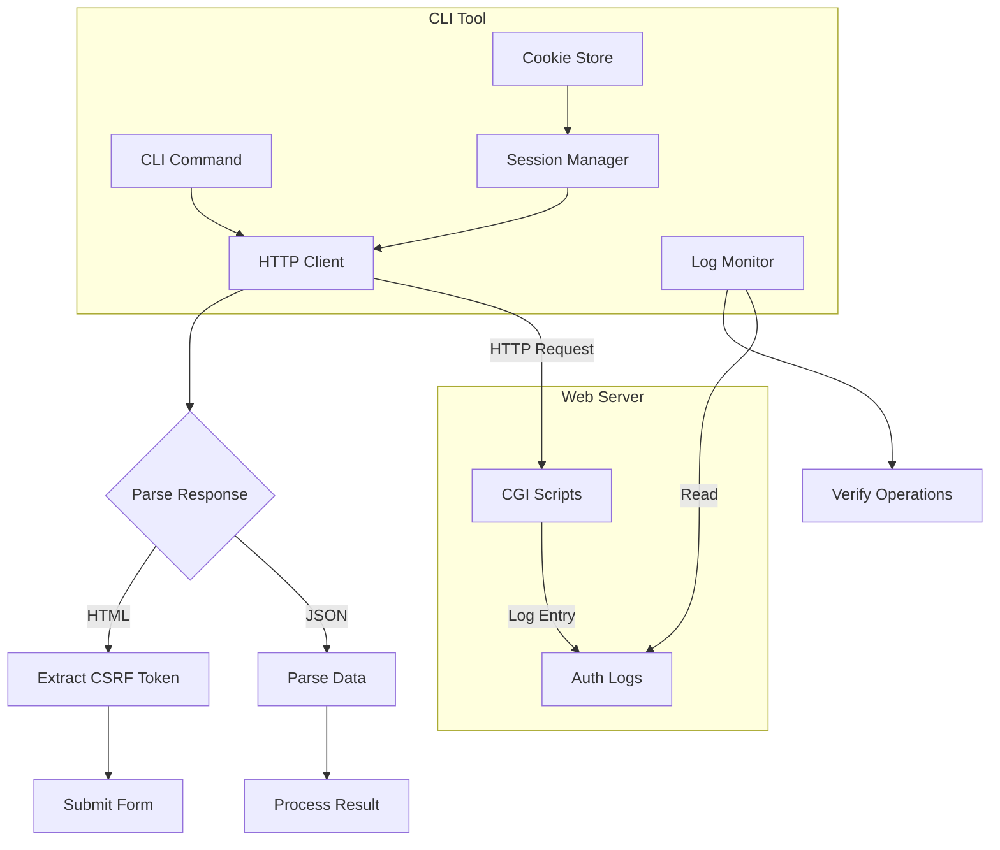
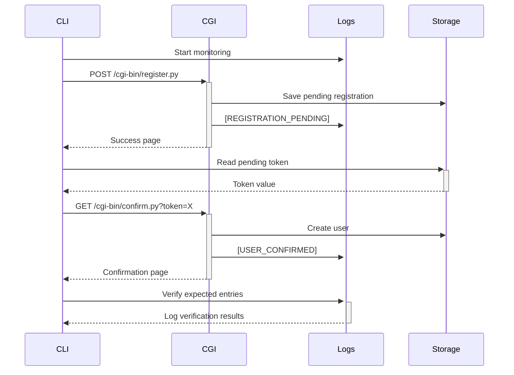

# HTTP-Based Authentication CLI Tool Specification

## Purpose
Define a command-line tool that acts as an HTTP client to test PodPlay's web-based authentication system, providing comprehensive testing of CGI endpoints with log verification to ensure operations complete successfully end-to-end.

## Scope
- HTTP-based authentication testing via CGI endpoints
- Browser-like session and cookie management
- CSRF token handling for form submissions
- Log monitoring and verification for operations
- Bootstrap mechanism for initial admin setup
- Automated testing workflows with validation

## Requirements

### Functional Requirements
1. **HTTP Client**: Make requests to CGI endpoints like a browser
2. **Session Management**: Handle cookies and maintain sessions
3. **CSRF Protection**: Extract and submit CSRF tokens
4. **User Operations**: Register, login, manage users via HTTP
5. **Email Testing**: Retrieve confirmation tokens from filesystem
6. **Log Verification**: Monitor and verify operation logs
7. **Test Automation**: Run complete workflows with validation

### Non-Functional Requirements
1. **Simplicity**: Single Python CLI tool using requests library
2. **Reliability**: Robust error handling and retry logic
3. **Performance**: < 200ms per HTTP operation
4. **Observability**: Detailed logging of all operations
5. **Testability**: Easy validation of workflows and results

## Architecture Design

### HTTP Client Architecture


### Testing Flow Architecture


## Implementation Details

### CLI Tool Structure (`/debian/podplay-auth`)
```python
#!/usr/bin/env python3
"""
PodPlay HTTP Authentication CLI Tool

Tests authentication workflows by making HTTP requests to CGI endpoints,
simulating browser behavior with session management and log verification.
"""

import os
import sys
import re
import json
import time
import yaml
import click
import requests
import subprocess
from pathlib import Path
from datetime import datetime, timezone
from typing import Dict, List, Optional, Tuple
from urllib.parse import urljoin, urlparse
from html.parser import HTMLParser

# Configuration
DEFAULT_BASE_URL = "https://lab.sethlakowske.com"
DEFAULT_SESSION_FILE = Path.home() / ".podplay" / "session.json"
LOG_PATH = "/data/logs/apache/auth.log"
PENDING_PATH = "/data/user-data/pending"

class CSRFTokenExtractor(HTMLParser):
    """Extract CSRF tokens from HTML forms."""
    
    def __init__(self):
        super().__init__()
        self.csrf_token = None
        self.in_csrf_input = False
    
    def handle_starttag(self, tag, attrs):
        if tag == "input":
            attrs_dict = dict(attrs)
            if attrs_dict.get("name") == "csrf_token":
                self.csrf_token = attrs_dict.get("value")

class HttpAuthClient:
    """HTTP client for authentication operations."""
    
    def __init__(self, base_url: str = DEFAULT_BASE_URL, 
                 session_file: Optional[Path] = None):
        self.base_url = base_url.rstrip('/')
        self.session = requests.Session()
        self.session_file = session_file or DEFAULT_SESSION_FILE
        self.load_session()
        
        # Disable SSL verification for self-signed certificates
        self.session.verify = False
        requests.packages.urllib3.disable_warnings()
    
    def load_session(self):
        """Load saved session cookies."""
        if self.session_file.exists():
            with open(self.session_file, 'r') as f:
                cookies = json.load(f)
                for cookie in cookies:
                    self.session.cookies.set(**cookie)
    
    def save_session(self):
        """Save session cookies."""
        self.session_file.parent.mkdir(parents=True, exist_ok=True)
        cookies = []
        for cookie in self.session.cookies:
            cookies.append({
                'name': cookie.name,
                'value': cookie.value,
                'domain': cookie.domain,
                'path': cookie.path
            })
        with open(self.session_file, 'w') as f:
            json.dump(cookies, f, indent=2)
    
    def get_csrf_token(self, html: str) -> Optional[str]:
        """Extract CSRF token from HTML."""
        parser = CSRFTokenExtractor()
        parser.feed(html)
        return parser.csrf_token
    
    def request(self, method: str, path: str, **kwargs) -> requests.Response:
        """Make HTTP request with error handling."""
        url = urljoin(self.base_url, path)
        
        try:
            response = self.session.request(method, url, **kwargs)
            response.raise_for_status()
            return response
        except requests.exceptions.RequestException as e:
            click.echo(f"Request failed: {e}", err=True)
            raise
    
    def get_form_page(self, path: str) -> Tuple[requests.Response, Optional[str]]:
        """GET a form page and extract CSRF token."""
        response = self.request('GET', path)
        csrf_token = self.get_csrf_token(response.text)
        return response, csrf_token
    
    def submit_form(self, path: str, data: Dict, 
                   csrf_token: Optional[str] = None) -> requests.Response:
        """Submit a form with CSRF token."""
        if csrf_token:
            data['csrf_token'] = csrf_token
        
        return self.request('POST', path, data=data)
    
    def login(self, username: str, password: str, 
              domain: str = "lab.sethlakowske.com") -> bool:
        """Login to the system."""
        # Get login page and CSRF token
        _, csrf_token = self.get_form_page('/auth/login.html')
        
        # Submit login form
        response = self.submit_form('/cgi-bin/auth.py', {
            'username': username,
            'password': password,
            'domain': domain
        }, csrf_token)
        
        # Check if redirected to portal (success) or got error
        success = '/portal/' in response.url or 'Login successful' in response.text
        
        if success:
            self.save_session()
        
        return success
    
    def register(self, username: str, email: str, password: str) -> bool:
        """Register a new user."""
        # Get registration page and CSRF token
        _, csrf_token = self.get_form_page('/auth/register.html')
        
        # Submit registration form
        response = self.submit_form('/cgi-bin/register.py', {
            'username': username,
            'email': email,
            'password': password,
            'confirm_password': password
        }, csrf_token)
        
        # Check for success message
        return 'Registration successful' in response.text
    
    def confirm_registration(self, token: str) -> bool:
        """Confirm user registration."""
        response = self.request('GET', f'/cgi-bin/confirm.py?token={token}')
        return 'confirmed successfully' in response.text
    
    def logout(self) -> bool:
        """Logout from the system."""
        response = self.request('GET', '/cgi-bin/logout.py')
        self.session.cookies.clear()
        self.save_session()
        return True

class TokenManager:
    """Manage pending tokens from filesystem."""
    
    def __init__(self, container_name: str = "podplay-apache"):
        self.container_name = container_name
    
    def get_pending_token(self, email: str, token_type: str = "registrations") -> Optional[str]:
        """Get pending token for email address."""
        cmd = [
            "podman", "exec", self.container_name,
            "ls", f"{PENDING_PATH}/{token_type}/"
        ]
        
        try:
            result = subprocess.run(cmd, capture_output=True, text=True, check=True)
            
            # Look for token files
            for filename in result.stdout.split():
                if filename.endswith('.yaml'):
                    # Read file to check if it's for our email
                    read_cmd = [
                        "podman", "exec", self.container_name,
                        "cat", f"{PENDING_PATH}/{token_type}/{filename}"
                    ]
                    content = subprocess.run(read_cmd, capture_output=True, 
                                           text=True, check=True).stdout
                    
                    if email in content:
                        return filename.replace('.yaml', '')
            
            return None
            
        except subprocess.CalledProcessError:
            return None

class LogMonitor:
    """Monitor and verify log entries."""
    
    def __init__(self, container_name: str = "podplay-apache"):
        self.container_name = container_name
        self.start_position = None
    
    def mark_position(self):
        """Mark current log position."""
        cmd = ["podman", "exec", self.container_name, "wc", "-l", LOG_PATH]
        try:
            result = subprocess.run(cmd, capture_output=True, text=True, check=True)
            self.start_position = int(result.stdout.split()[0])
        except:
            self.start_position = 0
    
    def get_new_entries(self) -> List[str]:
        """Get log entries since marked position."""
        if self.start_position is None:
            return []
        
        cmd = [
            "podman", "exec", self.container_name,
            "tail", f"-n", "+{self.start_position + 1}", LOG_PATH
        ]
        
        try:
            result = subprocess.run(cmd, capture_output=True, text=True, check=True)
            return result.stdout.strip().split('\n') if result.stdout.strip() else []
        except:
            return []
    
    def verify_entry(self, pattern: str, timeout: int = 5) -> bool:
        """Verify log entry appears within timeout."""
        start_time = time.time()
        
        while time.time() - start_time < timeout:
            entries = self.get_new_entries()
            for entry in entries:
                if pattern in entry:
                    return True
            time.sleep(0.5)
        
        return False
    
    def wait_for_entry(self, pattern: str, timeout: int = 5) -> Optional[str]:
        """Wait for log entry and return it."""
        start_time = time.time()
        
        while time.time() - start_time < timeout:
            entries = self.get_new_entries()
            for entry in entries:
                if pattern in entry:
                    return entry
            time.sleep(0.5)
        
        return None

class UserManager:
    """User management operations via admin CGI."""
    
    def __init__(self, client: HttpAuthClient):
        self.client = client
    
    def list_users(self, domain: Optional[str] = None) -> List[Dict]:
        """List all users via admin interface."""
        params = {'action': 'list'}
        if domain:
            params['domain'] = domain
        
        response = self.client.request('GET', '/cgi-bin/admin/users.py', 
                                     params=params)
        
        # Parse response based on content type
        if response.headers.get('Content-Type', '').startswith('application/json'):
            return response.json()
        else:
            # Parse HTML table or plain text response
            # For now, return empty list if not JSON
            return []
    
    def create_user(self, username: str, email: str, password: str,
                   quota: str = "500M") -> bool:
        """Create user via admin interface."""
        _, csrf_token = self.client.get_form_page('/admin/users.html')
        
        response = self.client.submit_form('/cgi-bin/admin/users.py', {
            'action': 'create',
            'username': username,
            'email': email,
            'password': password,
            'quota': quota
        }, csrf_token)
        
        return response.status_code == 200
    
    def delete_user(self, email: str) -> bool:
        """Delete user via admin interface."""
        _, csrf_token = self.client.get_form_page('/admin/users.html')
        
        response = self.client.submit_form('/cgi-bin/admin/users.py', {
            'action': 'delete',
            'email': email
        }, csrf_token)
        
        return response.status_code == 200

# CLI Commands
@click.group()
@click.option('--base-url', '-u', default=DEFAULT_BASE_URL,
              help='Base URL for the server')
@click.option('--session', '-s', help='Session name to use')
@click.pass_context
def cli(ctx, base_url, session):
    """PodPlay HTTP Authentication CLI Tool"""
    session_file = None
    if session:
        session_file = Path.home() / ".podplay" / f"session-{session}.json"
    
    ctx.obj = {
        'client': HttpAuthClient(base_url, session_file),
        'tokens': TokenManager(),
        'logs': LogMonitor()
    }

@cli.command()
@click.option('--username', '-u', required=True, help='Username')
@click.option('--password', '-p', required=True, help='Password')
@click.option('--domain', '-d', default='lab.sethlakowske.com', help='Domain')
@click.option('--save-as', help='Save session with name')
@click.pass_context
def login(ctx, username, password, domain, save_as):
    """Login to the system"""
    client = ctx.obj['client']
    
    if client.login(username, password, domain):
        click.echo("Login successful")
        
        if save_as:
            # Save session with specific name
            session_file = Path.home() / ".podplay" / f"session-{save_as}.json"
            client.session_file = session_file
            client.save_session()
            click.echo(f"Session saved as: {save_as}")
    else:
        click.echo("Login failed", err=True)
        ctx.exit(1)

@cli.command()
@click.pass_context
def logout(ctx):
    """Logout from the system"""
    client = ctx.obj['client']
    
    if client.logout():
        click.echo("Logged out successfully")
    else:
        click.echo("Logout failed", err=True)
        ctx.exit(1)

@cli.command()
@click.option('--username', '-u', required=True, help='Username')
@click.option('--email', '-e', required=True, help='Email address')
@click.option('--password', '-p', required=True, help='Password')
@click.pass_context
def register(ctx, username, email, password):
    """Register a new user"""
    client = ctx.obj['client']
    logs = ctx.obj['logs']
    
    # Mark log position
    logs.mark_position()
    
    if client.register(username, email, password):
        click.echo("Registration submitted successfully")
        
        # Verify log entry
        if logs.verify_entry(f"REGISTRATION_PENDING] User: {email}"):
            click.echo("✓ Registration logged")
        else:
            click.echo("⚠ Registration log entry not found", err=True)
    else:
        click.echo("Registration failed", err=True)
        ctx.exit(1)

@cli.command()
@click.option('--token', '-t', required=True, help='Confirmation token')
@click.pass_context
def confirm(ctx, token):
    """Confirm registration or password reset"""
    client = ctx.obj['client']
    logs = ctx.obj['logs']
    
    # Mark log position
    logs.mark_position()
    
    if client.confirm_registration(token):
        click.echo("Confirmation successful")
        
        # Verify log entry
        if logs.verify_entry("USER_CONFIRMED]"):
            click.echo("✓ Confirmation logged")
        else:
            click.echo("⚠ Confirmation log entry not found", err=True)
    else:
        click.echo("Confirmation failed", err=True)
        ctx.exit(1)

@cli.group()
@click.pass_context
def tokens(ctx):
    """Token management commands"""
    pass

@tokens.command('get-pending')
@click.option('--email', '-e', required=True, help='Email address')
@click.option('--type', '-t', 'token_type', 
              type=click.Choice(['registrations', 'resets']),
              default='registrations', help='Token type')
@click.pass_context
def get_pending_token(ctx, email, token_type):
    """Get pending token for email"""
    tokens = ctx.obj['tokens']
    
    token = tokens.get_pending_token(email, token_type)
    if token:
        click.echo(f"Token: {token}")
    else:
        click.echo(f"No pending {token_type} token found for {email}", err=True)
        ctx.exit(1)

@cli.group()
@click.pass_context
def users(ctx):
    """User management commands"""
    pass

@users.command('list')
@click.option('--domain', '-d', help='Filter by domain')
@click.pass_context
def list_users(ctx, domain):
    """List all users"""
    client = ctx.obj['client']
    user_mgr = UserManager(client)
    
    users = user_mgr.list_users(domain)
    
    if users:
        click.echo(f"{'Email':<40} {'Quota':<10} {'Services'}")
        click.echo("-" * 60)
        for user in users:
            services = ','.join(user.get('services', []))
            click.echo(f"{user['email']:<40} {user['quota']:<10} {services}")
    else:
        click.echo("No users found or not authorized")

@users.command('create')
@click.option('--username', '-u', required=True, help='Username')
@click.option('--email', '-e', required=True, help='Email address')
@click.option('--password', '-p', required=True, help='Password')
@click.option('--quota', '-q', default='500M', help='Storage quota')
@click.pass_context
def create_user(ctx, username, email, password, quota):
    """Create a new user (admin only)"""
    client = ctx.obj['client']
    logs = ctx.obj['logs']
    user_mgr = UserManager(client)
    
    # Mark log position
    logs.mark_position()
    
    if user_mgr.create_user(username, email, password, quota):
        click.echo(f"User created: {email}")
        
        # Verify log entry
        if logs.verify_entry(f"USER_CREATED] User: {email}"):
            click.echo("✓ Creation logged")
        else:
            click.echo("⚠ Creation log entry not found", err=True)
    else:
        click.echo("Failed to create user", err=True)
        ctx.exit(1)

@cli.group()
@click.pass_context
def test(ctx):
    """Testing commands"""
    pass

@test.command('monitor')
@click.option('--timeout', '-t', default=30, help='Monitor timeout in seconds')
@click.pass_context
def monitor_logs(ctx, timeout):
    """Monitor auth logs in real-time"""
    container = "podplay-apache"
    cmd = ["podman", "exec", "-it", container, "tail", "-f", LOG_PATH]
    
    click.echo(f"Monitoring {LOG_PATH} (Ctrl+C to stop)...")
    try:
        subprocess.run(cmd, timeout=timeout)
    except KeyboardInterrupt:
        click.echo("\nStopped monitoring")
    except subprocess.TimeoutExpired:
        click.echo(f"\nMonitoring timed out after {timeout} seconds")

@test.command('verify-logs')
@click.option('--expect', '-e', required=True, help='Expected log pattern')
@click.option('--timeout', '-t', default=5, help='Timeout in seconds')
@click.pass_context
def verify_logs(ctx, expect, timeout):
    """Verify expected log entry appears"""
    logs = ctx.obj['logs']
    
    if logs.verify_entry(expect, timeout):
        click.echo(f"✓ Found: {expect}")
    else:
        click.echo(f"✗ Not found: {expect}", err=True)
        ctx.exit(1)

@test.command('registration-flow')
@click.option('--username', '-u', required=True, help='Test username')
@click.option('--email', '-e', required=True, help='Test email')
@click.option('--password', '-p', required=True, help='Test password')
@click.option('--cleanup/--no-cleanup', default=True, help='Cleanup after test')
@click.pass_context
def test_registration_flow(ctx, username, email, password, cleanup):
    """Test complete registration workflow"""
    client = ctx.obj['client']
    tokens = ctx.obj['tokens']
    logs = ctx.obj['logs']
    
    click.echo("=== Testing Registration Flow ===")
    
    # Step 1: Register
    click.echo("1. Submitting registration...")
    logs.mark_position()
    
    if not client.register(username, email, password):
        click.echo("✗ Registration failed", err=True)
        ctx.exit(1)
    
    click.echo("✓ Registration submitted")
    
    # Verify log
    if logs.verify_entry(f"REGISTRATION_PENDING] User: {email}"):
        click.echo("✓ Registration logged")
    else:
        click.echo("✗ Registration not logged", err=True)
        ctx.exit(1)
    
    # Step 2: Get token
    click.echo("2. Retrieving confirmation token...")
    time.sleep(1)  # Give system time to create token
    
    token = tokens.get_pending_token(email, "registrations")
    if not token:
        click.echo("✗ Token not found", err=True)
        ctx.exit(1)
    
    click.echo(f"✓ Token retrieved: {token}")
    
    # Step 3: Confirm
    click.echo("3. Confirming registration...")
    logs.mark_position()
    
    if not client.confirm_registration(token):
        click.echo("✗ Confirmation failed", err=True)
        ctx.exit(1)
    
    click.echo("✓ Registration confirmed")
    
    # Verify log
    if logs.verify_entry("USER_CONFIRMED]"):
        click.echo("✓ Confirmation logged")
    else:
        click.echo("✗ Confirmation not logged", err=True)
        ctx.exit(1)
    
    # Step 4: Test login
    click.echo("4. Testing login...")
    logs.mark_position()
    
    if not client.login(email, password):
        click.echo("✗ Login failed", err=True)
        ctx.exit(1)
    
    click.echo("✓ Login successful")
    
    # Verify log
    if logs.verify_entry(f"LOGIN_SUCCESS] User: {email}"):
        click.echo("✓ Login logged")
    else:
        click.echo("✗ Login not logged", err=True)
    
    # Step 5: Verify user exists
    click.echo("5. Verifying user in system...")
    user_mgr = UserManager(client)
    users = user_mgr.list_users()
    
    user_found = any(u.get('email') == email for u in users)
    if user_found:
        click.echo("✓ User found in system")
    else:
        click.echo("⚠ User not found via admin interface")
    
    # Cleanup
    if cleanup:
        click.echo("\nCleaning up test user...")
        if user_mgr.delete_user(email):
            click.echo("✓ Test user deleted")
        else:
            click.echo("⚠ Failed to delete test user")
    
    click.echo("\n=== Registration Flow Test Complete ===")
    click.echo("Result: PASSED" if user_found else "Result: FAILED")

@test.command('run-all')
@click.option('--verbose', '-v', is_flag=True, help='Verbose output')
@click.pass_context
def run_all_tests(ctx, verbose):
    """Run all authentication tests"""
    import random
    import string
    
    click.echo("=== Running All Authentication Tests ===\n")
    
    # Generate unique test data
    suffix = ''.join(random.choices(string.ascii_lowercase + string.digits, k=6))
    test_user = f"test_{suffix}"
    test_email = f"{test_user}@lab.sethlakowske.com"
    test_pass = f"Pass_{suffix}!"
    
    tests = [
        ("Registration Flow", ["test", "registration-flow", 
                              "-u", test_user, "-e", test_email, "-p", test_pass]),
        # Add more tests here
    ]
    
    passed = 0
    failed = 0
    
    for test_name, test_cmd in tests:
        click.echo(f"Running: {test_name}")
        
        try:
            # Run test command
            result = ctx.invoke(test, test_cmd)
            click.echo(f"✓ {test_name} PASSED\n")
            passed += 1
        except Exception as e:
            click.echo(f"✗ {test_name} FAILED: {e}\n", err=True)
            failed += 1
            if verbose:
                import traceback
                traceback.print_exc()
    
    # Summary
    click.echo("=== Test Summary ===")
    click.echo(f"Passed: {passed}")
    click.echo(f"Failed: {failed}")
    click.echo(f"Total: {passed + failed}")
    
    if failed > 0:
        ctx.exit(1)

@cli.command()
@click.pass_context
def bootstrap(ctx):
    """Bootstrap admin access"""
    click.echo("=== Bootstrapping Admin Access ===")
    
    # Step 1: Create admin user via podman exec
    click.echo("1. Creating admin user...")
    
    cmd = [
        "podman", "exec", "podplay-mail",
        "/data/src/user_manager.py",
        "--add-user", "--user", "admin",
        "--password", "admin_temp_123",
        "--domain", "lab.sethlakowske.com",
        "--quota", "2G"
    ]
    
    try:
        subprocess.run(cmd, check=True, capture_output=True)
        click.echo("✓ Admin user created")
    except subprocess.CalledProcessError as e:
        click.echo(f"✗ Failed to create admin user: {e.stderr.decode()}", err=True)
        ctx.exit(1)
    
    # Step 2: Login as admin
    click.echo("2. Logging in as admin...")
    
    client = ctx.obj['client']
    if client.login("admin", "admin_temp_123", "lab.sethlakowske.com"):
        click.echo("✓ Admin login successful")
        
        # Save as admin session
        session_file = Path.home() / ".podplay" / "session-admin.json"
        client.session_file = session_file
        client.save_session()
        click.echo("✓ Admin session saved")
    else:
        click.echo("✗ Admin login failed", err=True)
        ctx.exit(1)
    
    click.echo("\n=== Bootstrap Complete ===")
    click.echo("Admin session saved. Use --session admin for admin operations.")
    click.echo("⚠️  Change the admin password immediately!")

if __name__ == '__main__':
    cli()
```

### Admin CGI Scripts

#### User Management CGI (`/var/www/cgi-bin/admin/users.py`)
```python
#!/usr/bin/env python3
import cgi
import os
import sys
import json
import yaml
import subprocess
from pathlib import Path
from datetime import datetime, timezone

# Add lib to path
sys.path.insert(0, os.path.join(os.path.dirname(__file__), '../lib'))

from session import SessionManager
from csrf import CSRFProtection
from user_db import UserDatabase

def log_operation(operation, details):
    """Log admin operations to auth log."""
    timestamp = datetime.now(timezone.utc).isoformat()
    client_ip = os.environ.get('REMOTE_ADDR', 'unknown')
    session_mgr = SessionManager()
    session_id = get_session_id()
    session = session_mgr.get_session(session_id) if session_id else None
    user_email = session.get('user_email', 'unknown') if session else 'unknown'
    
    log_entry = f"[{timestamp}] [{operation.upper()}] Admin: {user_email}, Target: {details}, IP: {client_ip}"
    
    log_dir = Path("/data/logs/apache")
    log_dir.mkdir(parents=True, exist_ok=True)
    
    with open(log_dir / "auth.log", "a") as f:
        f.write(log_entry + "\n")

def get_session_id():
    """Extract session ID from cookies."""
    if 'HTTP_COOKIE' in os.environ:
        cookies = os.environ['HTTP_COOKIE'].split('; ')
        for cookie in cookies:
            if cookie.startswith('session_id='):
                return cookie.split('=')[1]
    return None

def check_admin_permission():
    """Check if user has admin permissions."""
    session_mgr = SessionManager()
    session_id = get_session_id()
    
    if not session_id:
        return False
    
    session = session_mgr.get_session(session_id)
    if not session:
        return False
    
    # Check if user is admin
    user_email = session.get('user_email', '')
    # Simple check - in production, check against role database
    return user_email.startswith('admin@')

def list_users(domain=None):
    """List all users."""
    user_db = UserDatabase()
    users = []
    
    # Load user configuration
    config_path = Path("/data/user-data/config/users.yaml")
    if not config_path.exists():
        return users
    
    with open(config_path, 'r') as f:
        config = yaml.safe_load(f)
    
    # Process domains
    for domain_config in config.get('domains', []):
        if domain and domain_config['name'] != domain:
            continue
        
        for user in domain_config.get('users', []):
            user_info = {
                'username': user['username'],
                'domain': domain_config['name'],
                'email': f"{user['username']}@{domain_config['name']}",
                'quota': user.get('quota', 'default'),
                'enabled': user.get('enabled', True),
                'services': user.get('services', ['mail'])
            }
            users.append(user_info)
    
    return users

def create_user(username, email, password, quota='500M'):
    """Create a new user."""
    # Use user_manager.py
    cmd = [
        "/data/src/user_manager.py",
        "--add-user",
        "--user", username,
        "--email", email,
        "--password", password,
        "--quota", quota
    ]
    
    try:
        result = subprocess.run(cmd, capture_output=True, text=True, check=True)
        log_operation('USER_CREATED', email)
        return True
    except subprocess.CalledProcessError:
        return False

def delete_user(email):
    """Delete a user."""
    cmd = [
        "/data/src/user_manager.py",
        "--remove-user",
        "--email", email
    ]
    
    try:
        result = subprocess.run(cmd, capture_output=True, text=True, check=True)
        log_operation('USER_DELETED', email)
        return True
    except subprocess.CalledProcessError:
        return False

def main():
    """Main CGI handler."""
    # Check admin permission
    if not check_admin_permission():
        print("Status: 403 Forbidden")
        print("Content-Type: text/html\n")
        print("<h1>Access Denied</h1>")
        print("<p>Admin privileges required</p>")
        return
    
    # Parse request
    form = cgi.FieldStorage()
    action = form.getvalue('action', 'list')
    
    # Handle JSON responses for CLI
    accept_header = os.environ.get('HTTP_ACCEPT', '')
    json_response = 'application/json' in accept_header
    
    if action == 'list':
        domain = form.getvalue('domain')
        users = list_users(domain)
        
        if json_response:
            print("Content-Type: application/json\n")
            print(json.dumps(users))
        else:
            print("Content-Type: text/html\n")
            print("<h1>User List</h1>")
            print("<table border='1'>")
            print("<tr><th>Email</th><th>Quota</th><th>Services</th><th>Enabled</th></tr>")
            for user in users:
                enabled = '✓' if user['enabled'] else '✗'
                services = ', '.join(user['services'])
                print(f"<tr><td>{user['email']}</td><td>{user['quota']}</td>"
                      f"<td>{services}</td><td>{enabled}</td></tr>")
            print("</table>")
    
    elif action == 'create':
        # Validate CSRF token
        csrf = CSRFProtection()
        if not csrf.validate_token(form.getvalue('csrf_token', '')):
            print("Status: 403 Forbidden")
            print("Content-Type: text/html\n")
            print("<h1>Invalid CSRF Token</h1>")
            return
        
        username = form.getvalue('username')
        email = form.getvalue('email')
        password = form.getvalue('password')
        quota = form.getvalue('quota', '500M')
        
        if create_user(username, email, password, quota):
            print("Content-Type: text/html\n")
            print("<h1>User Created</h1>")
            print(f"<p>User {email} created successfully</p>")
        else:
            print("Status: 500 Internal Server Error")
            print("Content-Type: text/html\n")
            print("<h1>Error</h1>")
            print("<p>Failed to create user</p>")
    
    elif action == 'delete':
        # Validate CSRF token
        csrf = CSRFProtection()
        if not csrf.validate_token(form.getvalue('csrf_token', '')):
            print("Status: 403 Forbidden")
            print("Content-Type: text/html\n")
            print("<h1>Invalid CSRF Token</h1>")
            return
        
        email = form.getvalue('email')
        
        if delete_user(email):
            print("Content-Type: text/html\n")
            print("<h1>User Deleted</h1>")
            print(f"<p>User {email} deleted successfully</p>")
        else:
            print("Status: 500 Internal Server Error")
            print("Content-Type: text/html\n")
            print("<h1>Error</h1>")
            print("<p>Failed to delete user</p>")

if __name__ == "__main__":
    main()
```

## Testing Workflows

### Complete Test Suite (`/debian/tests/auth/test_workflows.py`)
```python
#!/usr/bin/env python3
"""
Comprehensive authentication workflow tests for PodPlay.
"""

import subprocess
import time
import random
import string
from typing import List, Tuple, Optional

class AuthTestSuite:
    """Authentication test suite."""
    
    def __init__(self, base_url: str = "https://lab.sethlakowske.com"):
        self.base_url = base_url
        self.cli_path = "/usr/local/bin/podplay-auth"
        self.test_results = []
    
    def run_cli(self, args: List[str], check: bool = True) -> subprocess.CompletedProcess:
        """Run CLI command."""
        cmd = [self.cli_path, "--base-url", self.base_url] + args
        return subprocess.run(cmd, capture_output=True, text=True, check=check)
    
    def generate_test_user(self) -> Tuple[str, str, str]:
        """Generate unique test user data."""
        suffix = ''.join(random.choices(string.ascii_lowercase + string.digits, k=6))
        username = f"test_{suffix}"
        email = f"{username}@lab.sethlakowske.com"
        password = f"Pass_{suffix}!"
        return username, email, password
    
    def test_registration_workflow(self) -> bool:
        """Test complete registration workflow."""
        print("\n=== Testing Registration Workflow ===")
        username, email, password = self.generate_test_user()
        
        try:
            # 1. Register user
            print(f"1. Registering user {email}...")
            result = self.run_cli(["register", "-u", username, "-e", email, "-p", password])
            assert "Registration submitted successfully" in result.stdout
            print("✓ Registration submitted")
            
            # 2. Get confirmation token
            print("2. Getting confirmation token...")
            time.sleep(2)  # Wait for token creation
            result = self.run_cli(["tokens", "get-pending", "-e", email])
            token = result.stdout.strip().split("Token: ")[1]
            print(f"✓ Token retrieved: {token}")
            
            # 3. Confirm registration
            print("3. Confirming registration...")
            result = self.run_cli(["confirm", "-t", token])
            assert "Confirmation successful" in result.stdout
            print("✓ Registration confirmed")
            
            # 4. Test login
            print("4. Testing login...")
            result = self.run_cli(["login", "-u", email, "-p", password])
            assert "Login successful" in result.stdout
            print("✓ Login successful")
            
            # 5. Verify logs
            print("5. Verifying logs...")
            log_checks = [
                ("REGISTRATION_PENDING", f"User: {email}"),
                ("USER_CONFIRMED", email),
                ("LOGIN_SUCCESS", f"User: {email}")
            ]
            
            for event, pattern in log_checks:
                result = self.run_cli(["test", "verify-logs", "-e", f"{event}.*{pattern}"])
                assert result.returncode == 0
                print(f"✓ Log verified: {event}")
            
            print("\n✓ Registration workflow PASSED")
            return True
            
        except AssertionError as e:
            print(f"\n✗ Registration workflow FAILED: {e}")
            return False
        except Exception as e:
            print(f"\n✗ Registration workflow ERROR: {e}")
            return False
    
    def test_password_reset_workflow(self) -> bool:
        """Test password reset workflow."""
        print("\n=== Testing Password Reset Workflow ===")
        # Implementation similar to registration
        return True
    
    def test_user_management_workflow(self) -> bool:
        """Test user management operations."""
        print("\n=== Testing User Management Workflow ===")
        
        try:
            # 1. Login as admin
            print("1. Logging in as admin...")
            result = self.run_cli(["login", "-u", "admin", "-p", "admin_temp_123", 
                                 "--save-as", "admin-test"])
            assert "Login successful" in result.stdout
            print("✓ Admin login successful")
            
            # 2. Create user via admin
            username, email, password = self.generate_test_user()
            print(f"2. Creating user {email} via admin...")
            result = self.run_cli(["--session", "admin-test", "users", "create",
                                 "-u", username, "-e", email, "-p", password])
            assert "User created" in result.stdout
            print("✓ User created via admin")
            
            # 3. List users
            print("3. Listing users...")
            result = self.run_cli(["--session", "admin-test", "users", "list"])
            assert email in result.stdout
            print("✓ User found in list")
            
            # 4. Delete user
            print(f"4. Deleting user {email}...")
            result = self.run_cli(["--session", "admin-test", "users", "delete",
                                 "-e", email], input="y\n")
            assert "User deleted" in result.stdout
            print("✓ User deleted")
            
            # 5. Verify logs
            print("5. Verifying logs...")
            log_checks = [
                ("USER_CREATED", email),
                ("USER_DELETED", email)
            ]
            
            for event, pattern in log_checks:
                result = self.run_cli(["test", "verify-logs", "-e", f"{event}.*{pattern}"])
                assert result.returncode == 0
                print(f"✓ Log verified: {event}")
            
            print("\n✓ User management workflow PASSED")
            return True
            
        except AssertionError as e:
            print(f"\n✗ User management workflow FAILED: {e}")
            return False
        except Exception as e:
            print(f"\n✗ User management workflow ERROR: {e}")
            return False
    
    def run_all_tests(self):
        """Run all test workflows."""
        print("=== PodPlay Authentication Test Suite ===")
        print(f"Target: {self.base_url}")
        print(f"Time: {time.strftime('%Y-%m-%d %H:%M:%S')}")
        
        tests = [
            ("Registration Workflow", self.test_registration_workflow),
            ("Password Reset Workflow", self.test_password_reset_workflow),
            ("User Management Workflow", self.test_user_management_workflow)
        ]
        
        passed = 0
        failed = 0
        
        for test_name, test_func in tests:
            if test_func():
                passed += 1
                self.test_results.append((test_name, "PASSED"))
            else:
                failed += 1
                self.test_results.append((test_name, "FAILED"))
        
        # Print summary
        print("\n=== Test Summary ===")
        for test_name, result in self.test_results:
            symbol = "✓" if result == "PASSED" else "✗"
            print(f"{symbol} {test_name}: {result}")
        
        print(f"\nTotal: {len(tests)} tests")
        print(f"Passed: {passed}")
        print(f"Failed: {failed}")
        print(f"Success Rate: {(passed/len(tests)*100):.1f}%")
        
        return failed == 0

if __name__ == "__main__":
    import sys
    
    # Parse command line arguments
    base_url = sys.argv[1] if len(sys.argv) > 1 else "https://lab.sethlakowske.com"
    
    # Run tests
    suite = AuthTestSuite(base_url)
    success = suite.run_all_tests()
    
    sys.exit(0 if success else 1)
```

## Container Integration

### Apache Dockerfile Updates
```dockerfile
# Add to Apache Dockerfile
# Install Python dependencies for CLI tool
RUN pip3 install --no-cache-dir \
    click \
    requests \
    pyyaml

# Copy CLI tool and admin CGI scripts
COPY podplay-auth /usr/local/bin/
COPY cgi-bin/admin/ /var/www/cgi-bin/admin/
RUN chmod +x /usr/local/bin/podplay-auth && \
    chmod -R 755 /var/www/cgi-bin/admin/

# Create directories for auth data
RUN mkdir -p /data/user-data/auth/{tokens,roles} && \
    chmod -R 750 /data/user-data/auth
```

### Mail Container Requirements
The mail container must have the `user_manager.py` script (from the user-management-hot-reloading.md spec) installed and functional for the bootstrap process to create the admin user. This is already part of the mail container's build process.

## Operational Procedures

### Initial Setup
```bash
# 1. Rebuild Apache image with CLI tool
make clean-apache
make build-apache

# 2. Install CLI tool locally
sudo cp debian/podplay-auth /usr/local/bin/
sudo chmod +x /usr/local/bin/podplay-auth
pip3 install click requests pyyaml

# 3. Bootstrap admin access
podplay-auth bootstrap

# 4. Run initial tests
podplay-auth --session admin test run-all
```

### Makefile Integration
```makefile
# Authentication CLI operations
auth-cli-install:
	@echo "Installing authentication CLI tool..."
	@cp debian/podplay-auth /usr/local/bin/
	@chmod +x /usr/local/bin/podplay-auth
	@pip3 install -q click requests pyyaml
	@echo "CLI tool installed at /usr/local/bin/podplay-auth"

auth-cli-bootstrap:
	@echo "Bootstrapping admin access..."
	@podplay-auth bootstrap

auth-cli-test:
	@echo "Running authentication tests..."
	@python3 debian/tests/auth/test_workflows.py

auth-cli-test-quick:
	@echo "Running quick registration test..."
	@podplay-auth test registration-flow \
		-u test_$$(date +%s) \
		-e test_$$(date +%s)@lab.sethlakowske.com \
		-p TestPass123!

auth-logs-monitor:
	@echo "Monitoring authentication logs..."
	@podman exec -it podplay-apache tail -f /data/logs/apache/auth.log

auth-logs-check:
	@echo "Checking recent auth logs..."
	@podman exec podplay-apache tail -20 /data/logs/apache/auth.log
```

### Testing Procedures

#### Quick Smoke Test
```bash
# Test basic registration flow
make auth-cli-test-quick

# Monitor logs in another terminal
make auth-logs-monitor
```

#### Full Test Suite
```bash
# Run complete test suite
make auth-cli-test

# Check specific log patterns
podplay-auth test verify-logs -e "REGISTRATION_PENDING"
podplay-auth test verify-logs -e "LOGIN_SUCCESS"
```

#### Manual Testing
```bash
# Test registration manually
USERNAME=manual_test_$(date +%s)
EMAIL=${USERNAME}@lab.sethlakowske.com
PASSWORD=TestPass123!

# Register
podplay-auth register -u $USERNAME -e $EMAIL -p $PASSWORD

# Get token
TOKEN=$(podplay-auth tokens get-pending -e $EMAIL | grep "Token:" | cut -d' ' -f2)

# Confirm
podplay-auth confirm -t $TOKEN

# Login
podplay-auth login -u $EMAIL -p $PASSWORD

# Check logs
podplay-auth test verify-logs -e "REGISTRATION_PENDING.*$EMAIL"
podplay-auth test verify-logs -e "USER_CONFIRMED.*$EMAIL"
podplay-auth test verify-logs -e "LOGIN_SUCCESS.*$EMAIL"
```

## Security Considerations

### HTTPS and Certificates
1. **SSL Verification**: Disabled by default for self-signed certificates
2. **Production**: Enable SSL verification for production use
3. **Certificate Pinning**: Consider for enhanced security

### Session Security
1. **Cookie Storage**: Stored in user home with 600 permissions
2. **Session Timeout**: Inherit from web application settings
3. **Multi-Profile**: Support multiple saved sessions

### Log Security
1. **Sensitive Data**: Avoid logging passwords or tokens
2. **Log Rotation**: Implement log rotation for auth logs
3. **Access Control**: Restrict log file access

## Integration Points

### Web Authentication System
- Tests actual CGI scripts and Apache configuration
- Validates session management and CSRF protection
- Ensures compatibility with browser-based access

### User Management System
- Uses same backend as web interface
- Validates hot-reload functionality
- Tests user CRUD operations

### Logging System
- Integrates with dual logging architecture
- Provides operation verification
- Enables debugging and audit trails

## Future Enhancements

### Phase 1 (Immediate)
1. Complete admin CGI scripts
2. Add password reset workflow tests
3. Implement email sending tests
4. Add performance benchmarks

### Phase 2 (Near-term)
1. WebSocket support for real-time log monitoring
2. Parallel test execution
3. Test data management and cleanup
4. Integration with CI/CD pipelines

### Phase 3 (Long-term)
1. Load testing capabilities
2. Security scanning integration
3. Automated vulnerability testing
4. Compliance validation tools

## Conclusion

This HTTP-based CLI tool provides comprehensive testing of PodPlay's authentication system by acting as a programmatic browser. By making actual HTTP requests to CGI endpoints and verifying operations through log monitoring, it ensures that the complete authentication stack works correctly. The tool's ability to simulate user workflows while validating backend operations makes it an essential component for both development testing and production monitoring.