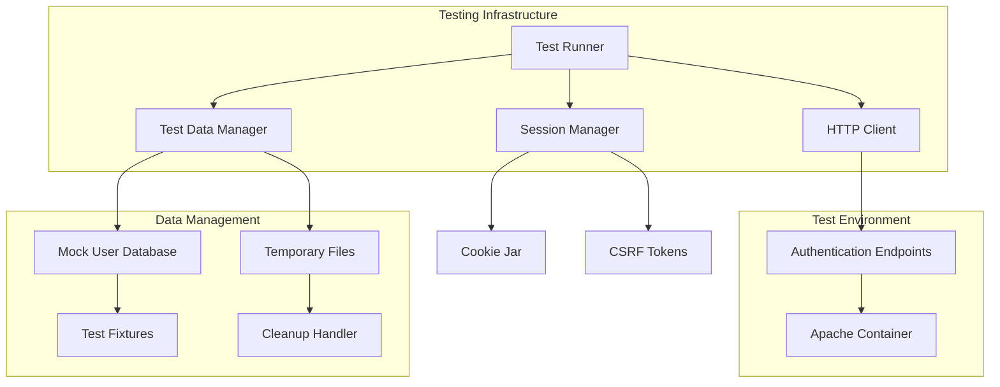

# Authentication Testing Framework Specification

## Purpose
Define a comprehensive programmatic testing framework for the PodPlay authentication system that validates functionality without requiring browser automation, using HTTP requests and Python scripting to test login, registration, password reset, and session management workflows.

## Scope
- Programmatic testing of all authentication endpoints
- Session management and CSRF protection validation
- Email workflow simulation and verification
- Rate limiting and security feature testing
- Integration with existing container infrastructure
- Automated test execution and reporting

## Requirements

### Functional Requirements
1. **Authentication Workflow Testing**: Test complete user registration, login, and password reset flows
2. **Session Management Testing**: Validate session creation, persistence, expiration, and logout
3. **Security Feature Testing**: Verify CSRF protection, rate limiting, and input validation
4. **Email Workflow Testing**: Simulate and verify email confirmation and reset workflows
5. **Portal Protection Testing**: Validate access control for protected areas
6. **Error Handling Testing**: Test system behavior with invalid inputs and edge cases
7. **Integration Testing**: Verify authentication system works with existing user management
8. **Performance Testing**: Measure response times and system behavior under load

### Non-Functional Requirements
1. **Execution Speed**: Complete test suite runs in < 30 seconds
2. **Reliability**: Tests are deterministic and produce consistent results
3. **Maintainability**: Clear test structure with reusable components
4. **Isolation**: Tests don't interfere with production data or other tests
5. **Reporting**: Clear pass/fail status with detailed error information
6. **CI/CD Integration**: Can be executed automatically in deployment pipelines

## Architecture Design

### Test Framework Components



### Core Components

#### 1. HTTP Client (`auth_client.py`)
- **Purpose**: Handle HTTP requests with session persistence
- **Features**: Cookie management, CSRF token handling, SSL verification
- **Dependencies**: `requests` library with persistent session

#### 2. Test Data Manager (`test_data.py`)
- **Purpose**: Generate and manage test user data
- **Features**: Mock users, email addresses, temporary passwords
- **Cleanup**: Automatic removal of test artifacts

#### 3. Email Workflow Simulator (`email_simulator.py`)
- **Purpose**: Test email-dependent workflows without SMTP
- **Features**: Token extraction, confirmation simulation
- **Integration**: Direct file system access to pending registrations

#### 4. Authentication Test Suite (`auth_tests.py`)
- **Purpose**: Comprehensive test scenarios
- **Coverage**: All authentication endpoints and workflows
- **Reporting**: Detailed test results and error information

## Test Scenarios

### 1. CSRF Protection Testing
```python
def test_csrf_token_generation():
    """Verify CSRF tokens are generated correctly"""
    
def test_csrf_token_validation():
    """Verify forms reject invalid CSRF tokens"""
    
def test_csrf_token_expiration():
    """Verify expired tokens are rejected"""
```

### 2. User Registration Flow
```python
def test_valid_registration():
    """Complete registration with valid data"""
    
def test_registration_validation():
    """Test input validation (email format, password strength)"""
    
def test_duplicate_email_prevention():
    """Verify duplicate emails are rejected"""
    
def test_email_confirmation():
    """Simulate email confirmation workflow"""
```

### 3. Login and Session Management
```python
def test_valid_login():
    """Login with correct credentials"""
    
def test_invalid_credentials():
    """Test various invalid credential scenarios"""
    
def test_session_persistence():
    """Verify session cookies work across requests"""
    
def test_session_expiration():
    """Test automatic session expiration"""
```

### 4. Portal Protection
```python
def test_protected_area_access():
    """Verify portal requires authentication"""
    
def test_authenticated_portal_access():
    """Verify authenticated users can access portal"""
    
def test_session_redirect():
    """Test redirect to original URL after login"""
```

### 5. Password Reset Flow
```python
def test_password_reset_request():
    """Request password reset for valid email"""
    
def test_password_reset_completion():
    """Complete password reset with valid token"""
    
def test_reset_token_expiration():
    """Verify reset tokens expire appropriately"""
```

### 6. Rate Limiting and Security
```python
def test_login_rate_limiting():
    """Verify rate limiting prevents brute force"""
    
def test_registration_rate_limiting():
    """Test registration attempt limits"""
    
def test_security_headers():
    """Verify security headers are set correctly"""
```

## Implementation Plan

### Directory Structure
```
/debian/tests/auth/
├── auth_client.py          # HTTP client with session management
├── test_data.py            # Test data generation and management
├── email_simulator.py      # Email workflow simulation
├── auth_tests.py           # Main test suite
├── fixtures/               # Test data files
│   ├── test_users.yaml
│   └── mock_emails.yaml
├── utils/                  # Utility functions
│   ├── cleanup.py          # Test artifact cleanup
│   └── helpers.py          # Common test helpers
└── reports/                # Test execution reports
    └── .gitkeep
```

### Test Execution Integration

#### Make Targets
```makefile
# Run authentication tests
test-auth:
	cd debian/tests/auth && python3 auth_tests.py

# Run specific test category
test-auth-login:
	cd debian/tests/auth && python3 auth_tests.py --category=login

# Run tests with verbose output
test-auth-verbose:
	cd debian/tests/auth && python3 auth_tests.py --verbose

# Clean test artifacts
test-auth-clean:
	cd debian/tests/auth && python3 utils/cleanup.py
```

#### Test Environment Setup
```bash
# Ensure containers are running
make pod-status || make pod-up

# Wait for services to be ready
./tests/auth/utils/wait_for_services.py

# Run test suite
make test-auth
```

### CI/CD Integration

#### Automated Testing Workflow
1. **Pre-deployment**: Run tests against existing deployment
2. **Post-deployment**: Verify new deployment functionality
3. **Quality Gates**: Fail deployment if authentication tests fail
4. **Reporting**: Generate test reports and metrics

#### Test Environment Configuration
```yaml
# test-config.yaml
test_environment:
  base_url: "https://localhost:8443"
  ssl_verify: false
  timeout: 30
  
test_data:
  user_count: 10
  cleanup_after: true
  
reporting:
  format: "junit"
  output_dir: "./reports"
```

## Security Considerations

### Test Data Security
- **No Real Emails**: Use mock email addresses for testing
- **Temporary Data**: All test data is automatically cleaned up
- **Isolation**: Tests use separate data volumes where possible

### Container Security
- **Read-Only Access**: Tests should not modify production data
- **Network Isolation**: Test traffic isolated from production
- **Credential Management**: No real credentials in test code

## Performance Testing

### Load Testing Scenarios
```python
def test_concurrent_logins():
    """Test system behavior with multiple simultaneous logins"""
    
def test_registration_load():
    """Test registration system under load"""
    
def test_session_scaling():
    """Verify session management scales appropriately"""
```

### Performance Metrics
- **Response Time**: < 100ms for authentication checks
- **Throughput**: Handle 100+ concurrent authentication requests
- **Resource Usage**: Monitor memory and CPU during tests

## Reporting and Monitoring

### Test Reports
- **JUnit XML**: For CI/CD integration
- **HTML Reports**: Human-readable test results
- **Performance Metrics**: Response times and throughput data

### Continuous Monitoring
- **Test Trend Analysis**: Track test success rates over time
- **Performance Regression**: Alert on performance degradation
- **Security Alerts**: Monitor for authentication vulnerabilities

## Future Enhancements

### Browser Testing Integration
- **Selenium Framework**: For complex UI interactions
- **Visual Regression**: Screenshot comparison testing
- **Accessibility Testing**: Automated accessibility validation

### Extended Security Testing
- **Penetration Testing**: Automated security vulnerability scanning
- **OWASP Integration**: Security testing against OWASP guidelines
- **Compliance Testing**: Verify against security compliance requirements

## Conclusion

This authentication testing framework provides comprehensive validation of the PodPlay authentication system through programmatic testing. By focusing on HTTP-based testing rather than browser automation, we achieve fast, reliable, and maintainable tests that can be easily integrated into CI/CD pipelines while thoroughly validating all security and functionality requirements.