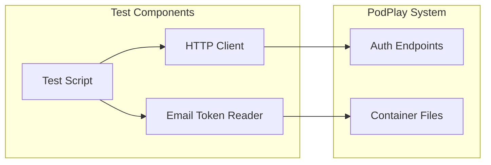

# Authentication Testing Framework Specification

## Purpose
Define a simple, maintainable testing approach for the PodPlay authentication system that validates core workflows using basic HTTP requests without browser automation or complex frameworks.

## Scope
- Core authentication workflow testing (registration, login, password reset)
- Email confirmation simulation
- Basic CSRF token validation
- Portal access verification
- Simple pass/fail reporting

## Design Principles
1. **Simplicity First**: Start with the minimum viable testing
2. **Clear and Readable**: Tests should be self-documenting
3. **Fast Execution**: Complete all tests in under 10 seconds
4. **Easy Debugging**: Clear error messages when tests fail
5. **Incremental Enhancement**: Build complexity only when needed

## Architecture

### Simple Component Design


### Core Components

#### 1. Simple Test Script (`simple_auth_test.py`)
- Single Python file (~150 lines)
- No testing framework dependencies
- Clear test functions for each workflow
- Simple pass/fail reporting

#### 2. Basic HTTP Client (`auth_client.py`)
- Minimal wrapper around requests library
- Session management for cookies
- CSRF token handling
- No complex error handling or retries

#### 3. Configuration (`test_config.py`)
- Simple Python file with constants
- No YAML parsing needed
- Basic settings only

## Test Workflows

### 1. User Registration Flow
```python
def test_registration_flow():
    """Test complete registration workflow"""
    # Step 1: Register new user
    # Step 2: Get email confirmation token
    # Step 3: Confirm registration
    # Step 4: Verify user can login
```

### 2. Password Reset Flow
```python
def test_password_reset_flow():
    """Test password reset workflow"""
    # Step 1: Create and confirm user
    # Step 2: Request password reset
    # Step 3: Get reset token
    # Step 4: Complete password reset
    # Step 5: Login with new password
```

### 3. Portal Protection
```python
def test_portal_protection():
    """Test portal access control"""
    # Step 1: Try accessing portal without auth (should redirect)
    # Step 2: Login with valid user
    # Step 3: Access portal (should succeed)
```

## Implementation

### Directory Structure (Simplified)
```
/debian/tests/auth/
├── simple_auth_test.py     # Main test script
├── auth_client.py          # Basic HTTP client
├── test_config.py          # Simple configuration
└── reports/                # Test output
    └── .gitkeep
```

### Test Execution
```bash
# Run all tests
make test-auth

# Output example:
Running authentication tests...
✓ Registration flow: PASSED
✓ Password reset flow: PASSED  
✓ Portal protection: PASSED
All tests passed! (7.2 seconds)
```

### Make Targets
```makefile
# Run authentication tests
test-auth:
    cd debian/tests/auth && python3 simple_auth_test.py

# Clean test artifacts
test-auth-clean:
    rm -f debian/tests/auth/reports/*.txt
```

## Example Test Implementation

```python
#!/usr/bin/env python3
"""Simple authentication testing for PodPlay"""

import sys
import time
from auth_client import SimpleAuthClient
import test_config as config

def test_registration_flow():
    """Test user registration and confirmation"""
    client = SimpleAuthClient(config.BASE_URL)
    
    # Generate unique test user
    timestamp = int(time.time())
    username = f"testuser{timestamp}"
    email = f"test{timestamp}@test.local"
    password = "TestPass123!"
    
    # Register user
    success = client.register(username, email, password)
    if not success:
        return False, "Registration failed"
    
    # Get confirmation token
    token = get_email_token(email, "registration")
    if not token:
        return False, "No confirmation token found"
    
    # Confirm registration
    success = client.confirm_registration(token)
    if not success:
        return False, "Confirmation failed"
    
    # Test login
    success = client.login(username, password)
    if not success:
        return False, "Login failed after confirmation"
    
    return True, "Registration flow completed"

def run_tests():
    """Run all tests and report results"""
    tests = [
        ("Registration flow", test_registration_flow),
        ("Password reset flow", test_password_reset_flow),
        ("Portal protection", test_portal_protection)
    ]
    
    print("Running authentication tests...")
    passed = 0
    failed = 0
    
    for test_name, test_func in tests:
        success, message = test_func()
        if success:
            print(f"✓ {test_name}: PASSED")
            passed += 1
        else:
            print(f"✗ {test_name}: FAILED - {message}")
            failed += 1
    
    print(f"\nTests: {passed} passed, {failed} failed")
    return failed == 0

if __name__ == "__main__":
    success = run_tests()
    sys.exit(0 if success else 1)
```

## Email Token Simulation

Simple approach to get email tokens without SMTP:
```python
def get_email_token(email, token_type):
    """Get token from container filesystem"""
    import subprocess
    
    # List files in pending directory
    cmd = f"podman exec {config.CONTAINER_NAME} ls /data/user-data/pending/{token_type}s/"
    result = subprocess.run(cmd.split(), capture_output=True, text=True)
    
    # Find token file for email
    for filename in result.stdout.split():
        if filename.endswith('.yaml'):
            # Read file and check if it's for our email
            cmd = f"podman exec {config.CONTAINER_NAME} cat /data/user-data/pending/{token_type}s/{filename}"
            content = subprocess.run(cmd.split(), capture_output=True, text=True).stdout
            if email in content:
                return filename.replace('.yaml', '')
    
    return None
```

## Future Enhancements

Once basic testing is proven and stable, consider adding:

1. **Error Case Testing**: Invalid inputs, wrong passwords
2. **Concurrent User Testing**: Multiple users at once
3. **Performance Metrics**: Response time tracking
4. **CI/CD Integration**: Automated test runs
5. **Test Data Management**: Cleanup old test users

But only add these when there's a clear need and the basic tests are working reliably.

## Conclusion

This simplified testing framework provides essential validation of PodPlay's authentication system while remaining easy to understand, maintain, and debug. By focusing on core workflows and avoiding framework complexity, we create a solid foundation that can grow with the project's needs.