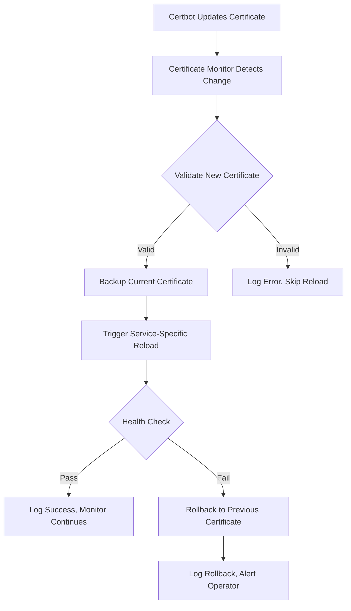

# Certificate Hot-Reloading Specification

## Purpose
Define an automatic certificate hot-reloading system that enables zero-downtime certificate updates across all services, supporting operational workflows for certificate escalation from self-signed through staging to production environments.

## Scope
- Automatic certificate change detection and service reloading
- Zero-downtime certificate updates without container restarts
- Support for certificate escalation workflows (self-signed → staging → production)
- Graceful reload mechanisms for Apache, Postfix, and Dovecot
- Health validation and automatic rollback capabilities
- Integration with existing dual logging and volume architecture

## Requirements

### Functional Requirements
1. **Zero-Downtime Updates**: Services must reload certificates without interrupting active connections
2. **Automatic Detection**: Certificate changes in `/data/certificates/` trigger immediate reload workflows
3. **Certificate Escalation**: Support operator workflows for upgrading certificate types seamlessly
4. **Service-Specific Reloads**: Each service uses appropriate graceful reload mechanisms
5. **Health Validation**: Post-reload health checks ensure service functionality
6. **Rollback Capability**: Automatic revert to previous certificates on failed reloads
7. **Multi-Domain Support**: Handle certificate updates for multiple domains independently

### Non-Functional Requirements
1. **Performance**: Certificate monitoring adds < 1% CPU overhead per container
2. **Reliability**: 99.9% successful reload rate under normal conditions
3. **Security**: Certificate validation prevents invalid/malicious certificate installation
4. **Observability**: All reload operations logged through dual logging architecture
5. **Maintainability**: Service-specific reload handlers follow consistent patterns

## Architecture Design

### Container Process Architecture
Each service container runs multiple processes:
```
Container Process Tree:
├── Main Service (PID 1)
│   ├── Apache (apache2ctl -D FOREGROUND)
│   ├── Postfix (master daemon)
│   └── Dovecot (dovecot daemon)
├── Certificate Monitor Daemon
│   └── cert_manager.py --hot-reload
└── Dual Logging Processes
    └── tail_service_logs()
```

### Certificate Change Detection Workflow


### Service-Specific Reload Strategies

#### Apache Reload Strategy
```bash
# Graceful reload without dropping connections
apache2ctl configtest && apache2ctl graceful
```
- **Mechanism**: `apache2ctl graceful` 
- **Behavior**: New processes serve new requests, old processes finish existing requests
- **Validation**: Configuration test before reload, health check after

#### Mail Service Reload Strategy
```bash
# Postfix graceful reload
postfix reload

# Dovecot configuration reload
doveadm reload
```
- **Mechanism**: Service-specific reload commands
- **Behavior**: Configuration reloaded without dropping active connections
- **Validation**: Service status check and SMTP/IMAP connectivity test

## Implementation Details

### Enhanced Certificate Manager

Extend existing `src/cert_manager.py` with hot-reload capabilities:

```python
class HotReloadEventHandler(CertificateEventHandler):
    """Enhanced certificate event handler with service reload capabilities."""
    
    def __init__(self, service_type, reload_strategy):
        super().__init__()
        self.service_type = service_type
        self.reload_strategy = reload_strategy
        self.backup_dir = "/tmp/cert-backup"
        
    def on_modified(self, event):
        if not event.is_directory and self.is_certificate(event.src_path):
            self.handle_certificate_change(event.src_path)
    
    def handle_certificate_change(self, cert_path):
        """Process certificate change with validation and reload."""
        try:
            # 1. Validate new certificate
            if not self.validate_certificate(cert_path):
                self.log_error(f"Invalid certificate: {cert_path}")
                return
                
            # 2. Backup current certificate
            self.backup_current_certificate(cert_path)
            
            # 3. Trigger service reload
            success = self.reload_strategy.execute()
            
            # 4. Validate reload success
            if success and self.health_check():
                self.log_success(f"Certificate reloaded: {cert_path}")
            else:
                self.rollback_certificate(cert_path)
                self.log_error(f"Reload failed, rolled back: {cert_path}")
                
        except Exception as e:
            self.log_error(f"Certificate reload error: {e}")
```

### Service Reload Strategies

#### Apache Reload Strategy
```python
class ApacheReloadStrategy:
    """Apache graceful reload implementation."""
    
    def execute(self):
        """Execute Apache graceful reload."""
        try:
            # Test configuration
            result = subprocess.run(['apache2ctl', 'configtest'], 
                                  capture_output=True, text=True)
            if result.returncode != 0:
                return False
                
            # Graceful reload
            result = subprocess.run(['apache2ctl', 'graceful'],
                                  capture_output=True, text=True)
            return result.returncode == 0
            
        except Exception:
            return False
    
    def health_check(self):
        """Verify Apache is responding after reload."""
        try:
            # Test HTTP and HTTPS endpoints
            http_ok = self.test_endpoint('http://localhost/')
            https_ok = self.test_endpoint('https://localhost/', verify_ssl=False)
            return http_ok and https_ok
        except Exception:
            return False
```

#### Mail Reload Strategy
```python
class MailReloadStrategy:
    """Mail service reload implementation."""
    
    def execute(self):
        """Execute mail service reloads."""
        try:
            # Copy certificates to service locations
            self.copy_certificates()
            
            # Reload Postfix
            postfix_result = subprocess.run(['postfix', 'reload'],
                                          capture_output=True, text=True)
            
            # Reload Dovecot
            dovecot_result = subprocess.run(['doveadm', 'reload'],
                                          capture_output=True, text=True)
            
            return (postfix_result.returncode == 0 and 
                   dovecot_result.returncode == 0)
                   
        except Exception:
            return False
    
    def copy_certificates(self):
        """Copy certificates to Postfix and Dovecot locations."""
        # Implementation matches existing mail-entrypoint.sh logic
        cert_file = f"/data/certificates/{self.domain}/fullchain.pem"
        key_file = f"/data/certificates/{self.domain}/privkey.pem"
        
        # Copy to Dovecot locations
        shutil.copy2(cert_file, "/etc/ssl/dovecot/server.pem")
        shutil.copy2(key_file, "/etc/ssl/dovecot/server.key")
        
        # Copy to Postfix locations  
        shutil.copy2(cert_file, "/etc/ssl/certs/dovecot/fullchain.pem")
        shutil.copy2(key_file, "/etc/ssl/certs/dovecot/privkey.pem")
        
        # Set proper permissions
        self.set_certificate_permissions()
```

### Container Integration

#### Enhanced Entrypoint Scripts
Modify service entrypoint scripts to start certificate monitoring daemon:

```bash
# apache-entrypoint.sh additions
start_certificate_monitor() {
    echo "[$(date -Iseconds)] [INFO] [APACHE] [CERT-MONITOR]: Starting certificate monitor..."
    
    /data/src/cert_manager.py \
        --hot-reload \
        --service-type apache \
        --watch /data/certificates/ \
        --domain "$FQDN" \
        >> /data/logs/apache/cert-reload.log 2>&1 &
    
    CERT_MONITOR_PID=$!
    echo $CERT_MONITOR_PID > /tmp/cert-monitor.pid
    echo "[$(date -Iseconds)] [INFO] [APACHE] [CERT-MONITOR]: Monitor started (PID: $CERT_MONITOR_PID)"
}

# Start certificate monitor before Apache
start_certificate_monitor

# Start Apache with PID tracking for graceful operations
exec apache2ctl -D FOREGROUND
```

#### Dockerfile Modifications
No significant changes required - leverage existing multi-process architecture:

```dockerfile
# Existing base Dockerfile already supports Python environment
# Certificate monitor runs as background process within container
# No additional process manager needed (systemd/supervisor)
```

## Service-Specific Configurations

### Apache Service
- **Reload Command**: `apache2ctl graceful`
- **Health Check**: HTTP/HTTPS endpoint tests
- **Backup Strategy**: Configuration files + certificate files
- **Rollback Time**: < 30 seconds

### Mail Service
- **Reload Commands**: `postfix reload` + `doveadm reload`  
- **Health Check**: SMTP (port 25/587) + IMAP (port 143/993) connectivity
- **Certificate Locations**: `/etc/ssl/dovecot/` and `/etc/ssl/certs/dovecot/`
- **Rollback Time**: < 60 seconds (includes certificate copy operations)

### Future Services (DNS, etc.)
- **Extension Pattern**: Implement `ServiceReloadStrategy` interface
- **Health Check Requirements**: Service-specific connectivity tests
- **Configuration**: Service-specific reload mechanisms

## Operational Procedures

### Certificate Escalation Workflow

#### Operator Commands
```bash
# 1. Start with self-signed certificates
make run-certbot DOMAIN=lab.example.com CERT_TYPE=self-signed

# 2. Upgrade to staging certificates (automatic reload)
make run-certbot DOMAIN=lab.example.com CERT_TYPE=staging

# 3. Upgrade to production certificates (automatic reload)
make run-certbot DOMAIN=lab.example.com CERT_TYPE=production
```

#### Expected Behavior
1. **Certificate Generation**: Certbot container updates certificates in `/data/certificates/`
2. **Automatic Detection**: Running services detect certificate changes within 1-2 seconds
3. **Graceful Reload**: Services reload configurations without dropping connections
4. **Health Validation**: Automatic health checks verify successful reload
5. **Logging**: All operations logged through dual logging architecture

### Monitoring and Alerting

#### Certificate Reload Logs
```
[2025-06-20T17:30:45+00:00] [INFO] [APACHE] [CERT-RELOAD]: Certificate change detected: /data/certificates/lab.example.com/fullchain.pem
[2025-06-20T17:30:45+00:00] [INFO] [APACHE] [CERT-RELOAD]: Validating new certificate...
[2025-06-20T17:30:45+00:00] [INFO] [APACHE] [CERT-RELOAD]: Certificate validation passed
[2025-06-20T17:30:45+00:00] [INFO] [APACHE] [CERT-RELOAD]: Backing up current certificate
[2025-06-20T17:30:46+00:00] [INFO] [APACHE] [CERT-RELOAD]: Executing graceful reload...
[2025-06-20T17:30:47+00:00] [INFO] [APACHE] [CERT-RELOAD]: Health check passed
[2025-06-20T17:30:47+00:00] [INFO] [APACHE] [CERT-RELOAD]: Certificate reload completed successfully
```

#### Health Check Endpoints
- **Apache**: `curl -f http://localhost/health` and `curl -f -k https://localhost/health`
- **Mail**: `nc -z localhost 25` and `nc -z localhost 993`

### Troubleshooting

#### Common Failure Scenarios

1. **Invalid Certificate Format**
   - **Detection**: Certificate validation fails
   - **Action**: Skip reload, log error
   - **Resolution**: Fix certificate generation

2. **Service Configuration Error**
   - **Detection**: `apache2ctl configtest` fails
   - **Action**: Skip reload, log error
   - **Resolution**: Fix service configuration

3. **Health Check Failure**
   - **Detection**: Post-reload connectivity tests fail
   - **Action**: Automatic rollback to previous certificate
   - **Resolution**: Investigate service logs

4. **Certificate Monitor Crash**
   - **Detection**: Monitor process not running
   - **Action**: Container restart may be required
   - **Resolution**: Check certificate monitor logs

## Security Considerations

### Certificate Validation Requirements
1. **Format Validation**: Ensure certificates are valid PEM format
2. **Expiration Checks**: Warn on certificates expiring within 30 days
3. **Key Matching**: Verify private key matches certificate
4. **Chain Validation**: Ensure certificate chain is complete

### Rollback Security
1. **Prevent Downgrade Attacks**: Log all certificate changes for audit
2. **Backup Integrity**: Verify backup certificates before rollback
3. **Time-based Rollback**: Limit rollback window to prevent replay attacks

### Audit Logging
All certificate operations logged with:
- **Timestamp**: ISO 8601 format
- **Action**: Certificate change type (new, updated, rollback)
- **Source**: Certificate file path and hash
- **Result**: Success/failure with details
- **Service**: Which service performed the reload

## Integration with Existing Architecture

### Dual Logging Integration
- Certificate reload events flow through existing dual logging infrastructure
- Structured log format consistent with other service logs
- Persistent logging to `/data/logs/{service}/cert-reload.log`

### Volume Architecture Compatibility
- Monitor existing `/data/certificates/` volume structure
- No changes required to certificate storage layout
- Compatible with current certbot container workflows

### Performance Impact
- **CPU Overhead**: < 1% per container for file system monitoring
- **Memory Overhead**: ~10MB per certificate monitor process
- **I/O Impact**: Minimal - only triggers on actual certificate changes
- **Network Impact**: None during monitoring, brief during health checks

## Future Enhancements

### Planned Extensions
1. **Metrics Integration**: Prometheus metrics for reload success/failure rates
2. **API Integration**: REST API for triggering manual certificate reloads
3. **Multi-Instance Coordination**: Handle certificate reloads across multiple container instances
4. **Advanced Health Checks**: SSL certificate verification in health checks

### Extension Points
- **Plugin Architecture**: Service-specific reload strategies as plugins
- **Configuration Management**: External configuration for reload behaviors
- **Integration APIs**: Webhook support for external certificate management systems