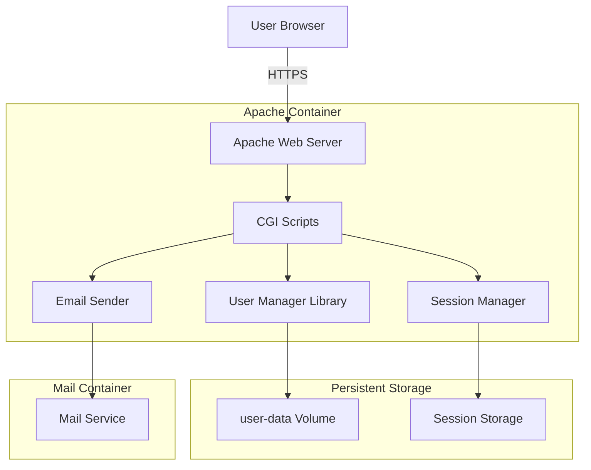

# User Authentication and Web Management Specification

## Purpose
Define a web-based user authentication and management system using Apache CGI scripts to provide self-service user registration, login, and password reset functionality with email confirmation workflows.

## Scope
- Web-based user login interface
- Self-service user registration with email confirmation
- Password reset workflow with email verification
- Session management and authentication
- Integration with existing user management and mail services
- Apache CGI script implementation

## Requirements

### Functional Requirements
1. **User Login**: Authenticate users via web form against existing user database
2. **User Registration**: Allow new users to register with email confirmation
3. **Password Reset**: Self-service password reset with email verification
4. **Session Management**: Secure session handling with appropriate timeouts
5. **Email Notifications**: Send confirmation and reset emails via existing mail service
6. **Rate Limiting**: Prevent brute force attacks on authentication endpoints
7. **Audit Logging**: Log all authentication attempts and user management operations

### Non-Functional Requirements
1. **Security**: CSRF protection, secure cookies, proper password hashing
2. **Performance**: < 100ms response time for authentication checks
3. **Reliability**: 99.9% availability for authentication services
4. **Usability**: Clean, accessible web interfaces
5. **Integration**: Seamless integration with existing user management system

## Architecture Design

### Component Architecture


### Directory Structure
```
/var/www/
├── html/
│   ├── auth/
│   │   ├── login.html
│   │   ├── register.html
│   │   ├── forgot-password.html
│   │   ├── reset-password.html
│   │   ├── confirm-success.html
│   │   └── error.html
│   ├── portal/
│   │   ├── index.html
│   │   ├── profile.html
│   │   └── settings.html
│   └── static/
│       ├── css/
│       │   └── auth.css
│       └── js/
│           └── auth.js
├── cgi-bin/
│   ├── auth.py                 # Login handler
│   ├── register.py             # Registration handler
│   ├── confirm.py              # Email confirmation handler
│   ├── reset-request.py        # Password reset request
│   ├── reset-password.py       # Password reset completion
│   ├── logout.py               # Logout handler
│   ├── profile.py              # User profile management
│   └── lib/
│       ├── __init__.py
│       ├── session.py          # Session management
│       ├── csrf.py             # CSRF token handling
│       ├── email.py            # Email sending utilities
│       ├── user_db.py          # User database interface
│       └── rate_limit.py       # Rate limiting
└── templates/
    ├── emails/
    │   ├── confirmation.html
    │   ├── confirmation.txt
    │   ├── reset.html
    │   └── reset.txt
    └── pages/
        └── base.html
```

### Data Structure Extensions

#### Pending Operations Storage
```
/data/user-data/
├── pending/
│   ├── registrations/
│   │   └── {token}.yaml        # Pending user registrations
│   ├── resets/
│   │   └── {token}.yaml        # Pending password resets
│   └── sessions/
│       └── {session_id}.yaml   # Active user sessions
```

#### Pending Registration Format
```yaml
# /data/user-data/pending/registrations/{token}.yaml
token: "a1b2c3d4e5f6..."
created_at: "2025-01-22T10:30:00Z"
expires_at: "2025-01-22T11:30:00Z"
user_data:
  username: "newuser"
  email: "newuser@lab.sethlakowske.com"
  password_hash: "{SHA512-CRYPT}$6$..."
  domain: "lab.sethlakowske.com"
  quota: "500M"
  services: ["mail", "webdav"]
ip_address: "192.168.1.100"
user_agent: "Mozilla/5.0..."
```

#### Session Format
```yaml
# /data/user-data/pending/sessions/{session_id}.yaml
session_id: "sess_a1b2c3d4e5f6..."
user_email: "user@lab.sethlakowske.com"
created_at: "2025-01-22T10:00:00Z"
expires_at: "2025-01-22T22:00:00Z"
last_activity: "2025-01-22T10:15:00Z"
ip_address: "192.168.1.100"
user_agent: "Mozilla/5.0..."
csrf_token: "csrf_xyz123..."
```

## Implementation Details

### Apache Configuration Updates

#### Enable CGI Module
```apache
# In Apache Dockerfile
RUN a2enmod cgi

# In Apache configuration
<Directory "/var/www/cgi-bin">
    Options +ExecCGI
    AddHandler cgi-script .py
    Require all granted
</Directory>

# Python CGI handler
<IfModule mod_cgi.c>
    AddHandler cgi-script .py
</IfModule>
```

#### Protected Areas Configuration
```apache
# Portal area protection
<Directory "/var/www/html/portal">
    Options -Indexes
    
    # Check for valid session cookie
    RewriteEngine On
    RewriteCond %{HTTP_COOKIE} !session_id=sess_[a-zA-Z0-9]{32}
    RewriteRule ^.*$ /auth/login.html?redirect=%{REQUEST_URI} [R,L]
</Directory>

# Rate limiting for auth endpoints
<Location "/cgi-bin/(auth|register|reset-request).py">
    # Implement rate limiting via mod_ratelimit or similar
    SetOutputFilter RATE_LIMIT
    SetEnv rate-limit 10
</Location>
```

### Core CGI Scripts

#### Login Handler (auth.py)
```python
#!/usr/bin/env python3
import cgi
import os
import sys
import hashlib
import secrets
import yaml
from datetime import datetime, timedelta, timezone
from pathlib import Path

# Add lib to path
sys.path.insert(0, os.path.join(os.path.dirname(__file__), 'lib'))

from session import SessionManager
from csrf import CSRFProtection
from user_db import UserDatabase
from rate_limit import RateLimiter

def main():
    # Set content type
    print("Content-Type: text/html\n")
    
    # Parse form data
    form = cgi.FieldStorage()
    
    # Initialize components
    session_mgr = SessionManager()
    csrf = CSRFProtection()
    user_db = UserDatabase()
    rate_limiter = RateLimiter()
    
    # Get client info
    client_ip = os.environ.get('REMOTE_ADDR', '')
    user_agent = os.environ.get('HTTP_USER_AGENT', '')
    
    # Check rate limit
    if not rate_limiter.check_limit(client_ip, 'login'):
        print_error("Too many login attempts. Please try again later.")
        return
    
    # Validate CSRF token
    csrf_token = form.getvalue('csrf_token', '')
    if not csrf.validate_token(csrf_token):
        print_error("Invalid security token. Please refresh and try again.")
        return
    
    # Get credentials
    username = form.getvalue('username', '').strip()
    password = form.getvalue('password', '')
    domain = form.getvalue('domain', 'lab.sethlakowske.com')
    
    # Validate input
    if not username or not password:
        print_error("Username and password are required.")
        return
    
    # Construct email if needed
    if '@' not in username:
        email = f"{username}@{domain}"
    else:
        email = username
    
    # Authenticate user
    if user_db.authenticate(email, password):
        # Create session
        session_id = session_mgr.create_session(email, client_ip, user_agent)
        
        # Set session cookie
        print(f"Set-Cookie: session_id={session_id}; Path=/; HttpOnly; Secure; SameSite=Strict")
        
        # Log successful login
        log_auth_event('login_success', email, client_ip)
        
        # Redirect to portal
        redirect_url = form.getvalue('redirect', '/portal/')
        print(f'<meta http-equiv="refresh" content="0;url={redirect_url}">')
        print("<html><body>Login successful. Redirecting...</body></html>")
    else:
        # Log failed attempt
        log_auth_event('login_failed', email, client_ip)
        rate_limiter.record_attempt(client_ip, 'login')
        
        print_error("Invalid username or password.")

def print_error(message):
    """Print error page"""
    print(f"""
    <html>
    <head>
        <title>Login Error</title>
        <link rel="stylesheet" href="/static/css/auth.css">
    </head>
    <body>
        <div class="auth-container">
            <h1>Login Error</h1>
            <p class="error">{message}</p>
            <a href="/auth/login.html">Back to Login</a>
        </div>
    </body>
    </html>
    """)

def log_auth_event(event_type, email, ip_address):
    """Log authentication events"""
    timestamp = datetime.now(timezone.utc).isoformat()
    log_entry = f"[{timestamp}] [{event_type.upper()}] User: {email}, IP: {ip_address}"
    
    # Write to auth log
    log_dir = Path("/data/logs/apache")
    log_dir.mkdir(parents=True, exist_ok=True)
    
    with open(log_dir / "auth.log", "a") as f:
        f.write(log_entry + "\n")

if __name__ == "__main__":
    main()
```

#### Registration Handler (register.py)
```python
#!/usr/bin/env python3
import cgi
import os
import sys
import secrets
import yaml
import re
from datetime import datetime, timedelta, timezone
from pathlib import Path

sys.path.insert(0, os.path.join(os.path.dirname(__file__), 'lib'))

from csrf import CSRFProtection
from user_db import UserDatabase
from email import EmailSender
from rate_limit import RateLimiter

def main():
    print("Content-Type: text/html\n")
    
    form = cgi.FieldStorage()
    
    # Initialize components
    csrf = CSRFProtection()
    user_db = UserDatabase()
    email_sender = EmailSender()
    rate_limiter = RateLimiter()
    
    # Get client info
    client_ip = os.environ.get('REMOTE_ADDR', '')
    user_agent = os.environ.get('HTTP_USER_AGENT', '')
    
    # Check rate limit
    if not rate_limiter.check_limit(client_ip, 'register'):
        print_error("Too many registration attempts. Please try again later.")
        return
    
    # Validate CSRF
    if not csrf.validate_token(form.getvalue('csrf_token', '')):
        print_error("Invalid security token.")
        return
    
    # Get form data
    username = form.getvalue('username', '').strip().lower()
    email = form.getvalue('email', '').strip().lower()
    password = form.getvalue('password', '')
    confirm_password = form.getvalue('confirm_password', '')
    
    # Validate input
    errors = validate_registration(username, email, password, confirm_password)
    if errors:
        print_error("<br>".join(errors))
        return
    
    # Check if user exists
    if user_db.user_exists(email):
        print_error("An account with this email already exists.")
        return
    
    # Generate confirmation token
    token = secrets.token_urlsafe(32)
    
    # Create pending registration
    pending_data = {
        'token': token,
        'created_at': datetime.now(timezone.utc).isoformat(),
        'expires_at': (datetime.now(timezone.utc) + timedelta(hours=1)).isoformat(),
        'user_data': {
            'username': username,
            'email': email,
            'password_hash': user_db.hash_password(password),
            'domain': email.split('@')[1],
            'quota': '500M',
            'services': ['mail', 'webdav']
        },
        'ip_address': client_ip,
        'user_agent': user_agent
    }
    
    # Save pending registration
    pending_dir = Path("/data/user-data/pending/registrations")
    pending_dir.mkdir(parents=True, exist_ok=True)
    
    with open(pending_dir / f"{token}.yaml", "w") as f:
        yaml.dump(pending_data, f)
    
    # Send confirmation email
    confirmation_url = f"https://lab.sethlakowske.com/cgi-bin/confirm.py?token={token}"
    email_sent = email_sender.send_confirmation_email(email, username, confirmation_url)
    
    if email_sent:
        # Log registration attempt
        log_auth_event('registration_pending', email, client_ip)
        
        print_success("Registration successful! Please check your email to confirm your account.")
    else:
        print_error("Failed to send confirmation email. Please try again later.")

def validate_registration(username, email, password, confirm_password):
    """Validate registration input"""
    errors = []
    
    # Username validation
    if not username:
        errors.append("Username is required")
    elif not re.match(r'^[a-zA-Z0-9_.-]+$', username):
        errors.append("Username can only contain letters, numbers, dots, dashes and underscores")
    elif len(username) < 3:
        errors.append("Username must be at least 3 characters")
    
    # Email validation
    if not email:
        errors.append("Email is required")
    elif not re.match(r'^[a-zA-Z0-9._%+-]+@[a-zA-Z0-9.-]+\.[a-zA-Z]{2,}$', email):
        errors.append("Invalid email address")
    
    # Password validation
    if not password:
        errors.append("Password is required")
    elif len(password) < 8:
        errors.append("Password must be at least 8 characters")
    elif password != confirm_password:
        errors.append("Passwords do not match")
    
    return errors

def print_error(message):
    """Print error page"""
    print(f"""
    <html>
    <head>
        <title>Registration Error</title>
        <link rel="stylesheet" href="/static/css/auth.css">
    </head>
    <body>
        <div class="auth-container">
            <h1>Registration Error</h1>
            <p class="error">{message}</p>
            <a href="/auth/register.html">Back to Registration</a>
        </div>
    </body>
    </html>
    """)

def print_success(message):
    """Print success page"""
    print(f"""
    <html>
    <head>
        <title>Registration Successful</title>
        <link rel="stylesheet" href="/static/css/auth.css">
    </head>
    <body>
        <div class="auth-container">
            <h1>Registration Successful</h1>
            <p class="success">{message}</p>
            <p>You will receive an email shortly with a confirmation link.</p>
            <p>The link will expire in 1 hour.</p>
            <a href="/auth/login.html">Go to Login</a>
        </div>
    </body>
    </html>
    """)

def log_auth_event(event_type, email, ip_address):
    """Log authentication events"""
    timestamp = datetime.now(timezone.utc).isoformat()
    log_entry = f"[{timestamp}] [{event_type.upper()}] User: {email}, IP: {ip_address}"
    
    log_dir = Path("/data/logs/apache")
    log_dir.mkdir(parents=True, exist_ok=True)
    
    with open(log_dir / "auth.log", "a") as f:
        f.write(log_entry + "\n")

if __name__ == "__main__":
    main()
```

### Supporting Libraries

#### Session Manager (lib/session.py)
```python
import os
import secrets
import yaml
from datetime import datetime, timedelta, timezone
from pathlib import Path

class SessionManager:
    def __init__(self):
        self.session_dir = Path("/data/user-data/pending/sessions")
        self.session_dir.mkdir(parents=True, exist_ok=True)
        self.session_duration = timedelta(hours=12)
    
    def create_session(self, user_email, ip_address, user_agent):
        """Create a new session"""
        session_id = f"sess_{secrets.token_hex(16)}"
        csrf_token = secrets.token_urlsafe(32)
        
        session_data = {
            'session_id': session_id,
            'user_email': user_email,
            'created_at': datetime.now(timezone.utc).isoformat(),
            'expires_at': (datetime.now(timezone.utc) + self.session_duration).isoformat(),
            'last_activity': datetime.now(timezone.utc).isoformat(),
            'ip_address': ip_address,
            'user_agent': user_agent,
            'csrf_token': csrf_token
        }
        
        # Save session
        with open(self.session_dir / f"{session_id}.yaml", "w") as f:
            yaml.dump(session_data, f)
        
        return session_id
    
    def get_session(self, session_id):
        """Get session data"""
        session_file = self.session_dir / f"{session_id}.yaml"
        
        if not session_file.exists():
            return None
        
        with open(session_file, "r") as f:
            session_data = yaml.safe_load(f)
        
        # Check expiration
        expires_at = datetime.fromisoformat(session_data['expires_at'])
        if datetime.now(timezone.utc) > expires_at:
            self.destroy_session(session_id)
            return None
        
        # Update last activity
        session_data['last_activity'] = datetime.now(timezone.utc).isoformat()
        
        with open(session_file, "w") as f:
            yaml.dump(session_data, f)
        
        return session_data
    
    def destroy_session(self, session_id):
        """Destroy a session"""
        session_file = self.session_dir / f"{session_id}.yaml"
        if session_file.exists():
            session_file.unlink()
    
    def cleanup_expired_sessions(self):
        """Clean up expired sessions"""
        for session_file in self.session_dir.glob("sess_*.yaml"):
            try:
                with open(session_file, "r") as f:
                    session_data = yaml.safe_load(f)
                
                expires_at = datetime.fromisoformat(session_data['expires_at'])
                if datetime.now(timezone.utc) > expires_at:
                    session_file.unlink()
            except:
                # Remove corrupted session files
                session_file.unlink()
```

#### User Database Interface (lib/user_db.py)
```python
import yaml
import crypt
import hashlib
from pathlib import Path

class UserDatabase:
    def __init__(self):
        self.users_config = Path("/data/user-data/config/users.yaml")
        self.dovecot_passwd = Path("/etc/dovecot/passwd")
    
    def authenticate(self, email, password):
        """Authenticate user against Dovecot passwd file"""
        if not self.dovecot_passwd.exists():
            return False
        
        with open(self.dovecot_passwd, "r") as f:
            for line in f:
                if line.startswith(f"{email}:"):
                    parts = line.strip().split(":")
                    if len(parts) >= 2:
                        stored_hash = parts[1]
                        return self.verify_password(password, stored_hash)
        
        return False
    
    def verify_password(self, password, stored_hash):
        """Verify password against hash"""
        if stored_hash.startswith("$6$"):  # SHA512-CRYPT
            return crypt.crypt(password, stored_hash) == stored_hash
        else:
            # Plain text (for development only)
            return password == stored_hash
    
    def hash_password(self, password):
        """Hash password using SHA512-CRYPT"""
        return crypt.crypt(password, crypt.mksalt(crypt.METHOD_SHA512))
    
    def user_exists(self, email):
        """Check if user exists"""
        if not self.users_config.exists():
            return False
        
        with open(self.users_config, "r") as f:
            config = yaml.safe_load(f)
        
        if 'domains' in config:
            for domain_config in config['domains']:
                for user in domain_config.get('users', []):
                    if '@' in user.get('username', ''):
                        if user['username'] == email:
                            return True
                    else:
                        user_email = f"{user['username']}@{domain_config['name']}"
                        if user_email == email:
                            return True
        
        return False
    
    def add_user(self, user_data):
        """Add user to configuration"""
        # Load existing config
        if self.users_config.exists():
            with open(self.users_config, "r") as f:
                config = yaml.safe_load(f)
        else:
            config = {'version': '1.0', 'domains': []}
        
        # Find or create domain entry
        domain = user_data['domain']
        domain_config = None
        
        for dc in config.get('domains', []):
            if dc['name'] == domain:
                domain_config = dc
                break
        
        if not domain_config:
            domain_config = {'name': domain, 'users': []}
            config['domains'].append(domain_config)
        
        # Add user
        username = user_data['email'].split('@')[0]
        new_user = {
            'username': username,
            'password': user_data.get('password', ''),  # Already hashed
            'aliases': [],
            'quota': user_data.get('quota', '500M'),
            'enabled': True,
            'services': user_data.get('services', ['mail'])
        }
        
        domain_config['users'].append(new_user)
        
        # Save config
        with open(self.users_config, "w") as f:
            yaml.dump(config, f, default_flow_style=False)
        
        # Touch file to trigger hot reload
        self.users_config.touch()
```

#### Email Sender (lib/email.py)
```python
import smtplib
import ssl
from email.mime.text import MIMEText
from email.mime.multipart import MIMEMultipart
from pathlib import Path

class EmailSender:
    def __init__(self):
        self.smtp_host = "localhost"
        self.smtp_port = 587
        self.smtp_user = "noreply@lab.sethlakowske.com"
        self.smtp_password = "system_password"  # Should be configured
        self.from_addr = "PodPlay System <noreply@lab.sethlakowske.com>"
        self.template_dir = Path("/var/www/templates/emails")
    
    def send_confirmation_email(self, to_email, username, confirmation_url):
        """Send registration confirmation email"""
        try:
            # Load template
            with open(self.template_dir / "confirmation.txt", "r") as f:
                text_template = f.read()
            
            with open(self.template_dir / "confirmation.html", "r") as f:
                html_template = f.read()
            
            # Replace placeholders
            replacements = {
                '{username}': username,
                '{confirmation_url}': confirmation_url,
                '{domain}': 'lab.sethlakowske.com'
            }
            
            text_content = text_template
            html_content = html_template
            
            for key, value in replacements.items():
                text_content = text_content.replace(key, value)
                html_content = html_content.replace(key, value)
            
            # Create message
            message = MIMEMultipart('alternative')
            message['Subject'] = 'Confirm your PodPlay account'
            message['From'] = self.from_addr
            message['To'] = to_email
            
            # Add parts
            text_part = MIMEText(text_content, 'plain')
            html_part = MIMEText(html_content, 'html')
            
            message.attach(text_part)
            message.attach(html_part)
            
            # Send email
            context = ssl.create_default_context()
            
            with smtplib.SMTP(self.smtp_host, self.smtp_port) as server:
                server.starttls(context=context)
                server.login(self.smtp_user, self.smtp_password)
                server.send_message(message)
            
            return True
            
        except Exception as e:
            print(f"Failed to send email: {e}")
            return False
    
    def send_reset_email(self, to_email, username, reset_url):
        """Send password reset email"""
        try:
            # Load template
            with open(self.template_dir / "reset.txt", "r") as f:
                text_template = f.read()
            
            with open(self.template_dir / "reset.html", "r") as f:
                html_template = f.read()
            
            # Replace placeholders
            replacements = {
                '{username}': username,
                '{reset_url}': reset_url,
                '{domain}': 'lab.sethlakowske.com'
            }
            
            text_content = text_template
            html_content = html_template
            
            for key, value in replacements.items():
                text_content = text_content.replace(key, value)
                html_content = html_content.replace(key, value)
            
            # Create message
            message = MIMEMultipart('alternative')
            message['Subject'] = 'Reset your PodPlay password'
            message['From'] = self.from_addr
            message['To'] = to_email
            
            # Add parts
            text_part = MIMEText(text_content, 'plain')
            html_part = MIMEText(html_content, 'html')
            
            message.attach(text_part)
            message.attach(html_part)
            
            # Send email
            context = ssl.create_default_context()
            
            with smtplib.SMTP(self.smtp_host, self.smtp_port) as server:
                server.starttls(context=context)
                server.login(self.smtp_user, self.smtp_password)
                server.send_message(message)
            
            return True
            
        except Exception as e:
            print(f"Failed to send email: {e}")
            return False
```

### HTML Templates

#### Login Page (login.html)
```html
<!DOCTYPE html>
<html lang="en">
<head>
    <meta charset="UTF-8">
    <meta name="viewport" content="width=device-width, initial-scale=1.0">
    <title>PodPlay Login</title>
    <link rel="stylesheet" href="/static/css/auth.css">
</head>
<body>
    <div class="auth-container">
        <h1>PodPlay Login</h1>
        
        <form action="/cgi-bin/auth.py" method="POST">
            <input type="hidden" name="csrf_token" value="{CSRF_TOKEN}">
            
            <div class="form-group">
                <label for="username">Username or Email:</label>
                <input type="text" id="username" name="username" required 
                       placeholder="user or user@domain.com">
            </div>
            
            <div class="form-group">
                <label for="password">Password:</label>
                <input type="password" id="password" name="password" required>
            </div>
            
            <div class="form-group">
                <label for="domain">Domain:</label>
                <select id="domain" name="domain">
                    <option value="lab.sethlakowske.com">lab.sethlakowske.com</option>
                </select>
            </div>
            
            <button type="submit" class="btn btn-primary">Login</button>
        </form>
        
        <div class="auth-links">
            <a href="/auth/register.html">Create Account</a> |
            <a href="/auth/forgot-password.html">Forgot Password?</a>
        </div>
    </div>
</body>
</html>
```

#### Email Templates

##### Confirmation Email (templates/emails/confirmation.txt)
```
Hello {username},

Welcome to PodPlay! Please confirm your email address by clicking the link below:

{confirmation_url}

This link will expire in 1 hour.

If you did not create an account, please ignore this email.

Best regards,
The PodPlay Team
{domain}
```

##### Confirmation Email HTML (templates/emails/confirmation.html)
```html
<!DOCTYPE html>
<html>
<head>
    <meta charset="UTF-8">
    <style>
        body {
            font-family: Arial, sans-serif;
            line-height: 1.6;
            color: #333;
            max-width: 600px;
            margin: 0 auto;
            padding: 20px;
        }
        .header {
            background-color: #007bff;
            color: white;
            padding: 20px;
            text-align: center;
            border-radius: 5px 5px 0 0;
        }
        .content {
            background-color: #f8f9fa;
            padding: 30px;
            border-radius: 0 0 5px 5px;
        }
        .button {
            display: inline-block;
            padding: 12px 30px;
            background-color: #007bff;
            color: white;
            text-decoration: none;
            border-radius: 5px;
            margin: 20px 0;
        }
        .footer {
            text-align: center;
            color: #666;
            font-size: 0.9em;
            margin-top: 30px;
        }
    </style>
</head>
<body>
    <div class="header">
        <h1>Welcome to PodPlay!</h1>
    </div>
    
    <div class="content">
        <p>Hello {username},</p>
        
        <p>Thank you for registering with PodPlay. To complete your registration, 
        please confirm your email address by clicking the button below:</p>
        
        <center>
            <a href="{confirmation_url}" class="button">Confirm Email Address</a>
        </center>
        
        <p>Or copy and paste this link into your browser:</p>
        <p style="word-break: break-all; background: #e9ecef; padding: 10px; border-radius: 3px;">
            {confirmation_url}
        </p>
        
        <p><strong>This link will expire in 1 hour.</strong></p>
        
        <p>If you did not create an account, please ignore this email.</p>
    </div>
    
    <div class="footer">
        <p>Best regards,<br>The PodPlay Team<br>{domain}</p>
    </div>
</body>
</html>
```

### Apache Configuration Updates

#### Modified Apache Dockerfile
```dockerfile
FROM base-debian:latest

RUN apt-get update && apt-get install -y --no-install-recommends \
    apache2 \
    apache2-utils \
    python3 \
    python3-yaml \
    python3-pip \
    && rm -rf /var/lib/apt/lists/*

# Install Python dependencies
RUN pip3 install --no-cache-dir \
    python-crypt

# Enable required modules including CGI
RUN a2enmod ssl headers rewrite http2 cgi

# Add www-data to certgroup
RUN usermod -a -G certgroup www-data

# Create CGI and web directories
RUN mkdir -p /var/www/cgi-bin /var/www/html/auth /var/www/html/portal \
    /var/www/html/static/css /var/www/html/static/js \
    /var/www/templates/emails /var/www/templates/pages

# Copy configuration templates
COPY configs/ /etc/apache2/templates/
COPY web/ /var/www/
COPY entrypoint.sh /

# Set permissions for CGI scripts
RUN chmod -R 755 /var/www/cgi-bin && \
    chown -R www-data:www-data /var/www

RUN chmod +x /entrypoint.sh

EXPOSE 80 443

ENTRYPOINT ["/entrypoint.sh"]
```

#### Apache Virtual Host Configuration Addition
```apache
# Add to virtual host configuration
# CGI configuration
ScriptAlias /cgi-bin/ /var/www/cgi-bin/
<Directory "/var/www/cgi-bin">
    Options +ExecCGI
    AddHandler cgi-script .py
    Require all granted
</Directory>

# Protected portal area
<Directory "/var/www/html/portal">
    Options -Indexes
    
    # Use Apache auth handler to check sessions
    AuthType Custom
    AuthName "Portal Access"
    Require valid-user
    
    # Fallback: redirect to login if no valid session
    ErrorDocument 401 /auth/login.html
</Directory>

# Rate limiting for authentication endpoints
<Location ~ "^/cgi-bin/(auth|register|reset-request)\.py$">
    <IfModule mod_ratelimit.c>
        SetOutputFilter RATE_LIMIT
        SetEnv rate-limit 10
        SetEnv rate-limit-burst 20
    </IfModule>
</Location>

# Security headers for auth pages
<Directory "/var/www/html/auth">
    Header always set X-Frame-Options "DENY"
    Header always set X-Content-Type-Options "nosniff"
    Header always set X-XSS-Protection "1; mode=block"
</Directory>
```

## Security Considerations

### Password Security
1. **Hashing**: All passwords hashed with SHA512-CRYPT before storage
2. **Minimum Requirements**: 8 character minimum, complexity encouraged
3. **No Plain Text**: Passwords never stored or logged in plain text
4. **Secure Transmission**: All authentication over HTTPS only

### Session Security
1. **Secure Cookies**: HttpOnly, Secure, SameSite=Strict flags
2. **CSRF Protection**: Token validation on all state-changing operations
3. **Session Expiry**: 12-hour default timeout with activity tracking
4. **IP Validation**: Optional IP address binding for sessions

### Rate Limiting
1. **Login Attempts**: Maximum 10 attempts per IP per hour
2. **Registration**: Maximum 5 registrations per IP per day
3. **Password Reset**: Maximum 3 reset requests per email per hour
4. **Distributed Tracking**: Rate limits tracked in shared storage

### Input Validation
1. **Username**: Alphanumeric with dots, dashes, underscores only
2. **Email**: Valid email format with domain verification
3. **XSS Prevention**: All output properly escaped
4. **SQL Injection**: No SQL used, YAML storage only

## Integration Points

### User Manager Integration
- Confirmation handler calls user_manager to add users
- Password reset handler updates user passwords
- Changes trigger hot reload via file touch

### Mail Service Integration
- Email sender uses local SMTP submission
- Requires mail service account for sending
- Templates support both text and HTML formats

### Logging Integration
- All authentication events logged to `/data/logs/apache/auth.log`
- Integrates with dual logging architecture
- Structured log format for analysis

## Operational Procedures

### Initial Setup
```bash
# Create required directories
podman exec apache mkdir -p /data/user-data/pending/{registrations,resets,sessions}

# Set permissions
podman exec apache chown -R www-data:www-data /data/user-data/pending

# Create email sending account
podman exec mail /data/src/user_manager.py \
  --add-user --user noreply --password system_password \
  --domain lab.sethlakowske.com
```

### Monitoring
```bash
# View authentication logs
podman exec apache tail -f /data/logs/apache/auth.log

# Check pending registrations
podman exec apache ls -la /data/user-data/pending/registrations/

# Monitor active sessions
podman exec apache ls -la /data/user-data/pending/sessions/
```

### Maintenance
```bash
# Clean up expired sessions
podman exec apache /var/www/cgi-bin/lib/cleanup.py --sessions

# Clean up expired registrations
podman exec apache /var/www/cgi-bin/lib/cleanup.py --registrations

# View rate limit status
podman exec apache /var/www/cgi-bin/lib/rate_limit.py --status
```

## Testing Procedures

### Functional Testing
1. **Login Flow**: Test valid/invalid credentials
2. **Registration Flow**: Complete registration with email confirmation
3. **Password Reset**: Request and complete password reset
4. **Session Management**: Verify timeout and logout

### Security Testing
1. **CSRF**: Attempt requests without valid tokens
2. **Rate Limiting**: Verify limits are enforced
3. **Session Hijacking**: Test session security features
4. **Input Validation**: Test with malicious input

### Integration Testing
1. **Email Delivery**: Verify emails are sent and received
2. **User Creation**: Confirm users are added to system
3. **Hot Reload**: Verify changes trigger service reload
4. **Logging**: Check all events are properly logged

## Future Enhancements

### Phase 2 Features
1. **Two-Factor Authentication**: TOTP support
2. **OAuth Integration**: External identity providers
3. **Account Management**: Profile updates, service management
4. **Admin Interface**: User administration panel

### Phase 3 Features
1. **SSO Integration**: SAML/OIDC support
2. **API Access**: RESTful API for user management
3. **Audit Trail**: Comprehensive activity logging
4. **Compliance**: GDPR data management tools