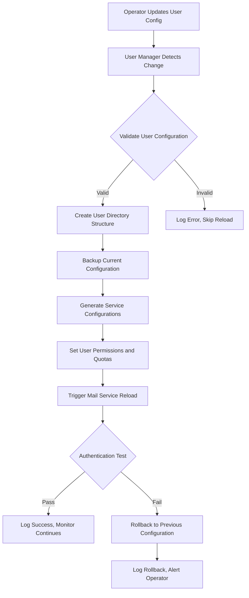

# User Management Hot-Reloading Specification

## Purpose
Define an automatic user management and hot-reloading system that enables zero-downtime user configuration updates across mail services, supporting operational workflows for rapid test user creation and password management without container restarts.

## Scope
- Automatic user configuration change detection and service reloading
- Zero-downtime user management updates without container restarts
- Support for quick test user creation and password updates
- Dynamic generation of Postfix virtual mailbox maps and Dovecot password databases
- Integration with existing dual logging and volume architecture
- Replacement of hard-coded passwords with dynamic user management

## Requirements

### Functional Requirements
1. **Zero-Downtime Updates**: User configuration changes reload without interrupting mail services
2. **Automatic Detection**: User configuration changes in `/data/users/` trigger immediate reload workflows
3. **Quick Test Users**: Operators can rapidly create test users (e.g., test1/password1) for validation
4. **Dynamic Configuration**: Generate Postfix vmailbox, valias, and Dovecot passwd files from user definitions
5. **Service-Specific Reloads**: Mail services use appropriate reload mechanisms
6. **Authentication Validation**: Post-reload authentication tests ensure user access
7. **Multi-Domain Support**: Handle user management for multiple domains independently

### Non-Functional Requirements
1. **Performance**: User monitoring adds < 1% CPU overhead per container
2. **Reliability**: 99.9% successful reload rate under normal conditions
3. **Security**: Password hashing, validation, and secure storage
4. **Observability**: All user management operations logged through dual logging architecture
5. **Maintainability**: User management follows consistent patterns with certificate management

## Architecture Design

### Container Process Architecture
Each mail service container runs multiple processes:
```
Mail Container Process Tree:
├── Main Mail Services (PID 1)
│   ├── Postfix (master daemon)
│   └── Dovecot (dovecot daemon)
├── User Manager Daemon
│   └── user_manager.py --hot-reload
├── Certificate Monitor Daemon
│   └── cert_manager.py --hot-reload
└── Dual Logging Processes
    └── tail_service_logs()
```

### User Data Architecture

#### Enhanced Single Volume Structure
```
/data/user-data/
├── config/
│   ├── users.yaml                    # User definitions
│   ├── quotas.yaml                   # Per-user quotas
│   └── service-templates/            # Service config templates
├── users/
│   ├── {username}@{domain}/
│   │   ├── mail/                     # Maildir structure
│   │   │   ├── Maildir/
│   │   │   └── sieve/
│   │   ├── files/                    # WebDAV/file storage
│   │   │   ├── Documents/
│   │   │   ├── Pictures/
│   │   │   └── Shared/
│   │   ├── git/                      # Git repositories
│   │   │   ├── repo1.git/
│   │   │   └── repo2.git/
│   │   ├── www/                      # Personal web content
│   │   │   ├── public_html/
│   │   │   └── private/
│   │   └── .profile/                 # User metadata
│   │       ├── quota.conf
│   │       ├── preferences.yaml
│   │       └── service-access.yaml
└── shared/
    ├── public/                       # Domain-wide shared content
    ├── templates/                    # Shared templates
    └── admin/                        # Admin tools and backups
        ├── user-backups/
        └── migration-tools/
```

### User Configuration Change Detection Workflow


### User Configuration Format

#### User Definition Structure
```yaml
# /data/user-data/config/users.yaml
version: "1.0"
domains:
  - name: "lab.sethlakowske.com"
    users:
      - username: "admin"
        password: "secure_admin_password"
        aliases: ["postmaster", "root"]
        quota: "1G"
        enabled: true
        services: ["mail", "webdav", "git", "www"]
      - username: "test1"
        password: "password1"
        aliases: []
        quota: "100M"
        enabled: true
        services: ["mail"]
      - username: "developer"
        password: "dev_password"
        aliases: ["dev"]
        quota: "2G"
        enabled: true
        services: ["mail", "git", "www"]

# Quick test user format
test_users:
  - username: "test1"
    password: "password1"
    domain: "lab.sethlakowske.com"
    quota: "50M"
    services: ["mail"]
  - username: "test2"
    password: "password2"
    domain: "lab.sethlakowske.com"
    quota: "50M"
    services: ["mail", "webdav"]
```

#### Quota Configuration
```yaml
# /data/user-data/config/quotas.yaml
default_quotas:
  test_users: "50M"
  regular_users: "500M"
  admin_users: "2G"

service_quotas:
  mail: "50%"      # 50% of user quota for mail
  files: "30%"     # 30% of user quota for WebDAV files
  git: "15%"       # 15% of user quota for git repositories
  www: "5%"        # 5% of user quota for web content

monitoring:
  warning_threshold: 80    # Warn at 80% usage
  critical_threshold: 95   # Critical at 95% usage
  cleanup_threshold: 98    # Auto-cleanup temp files at 98%
```

#### Generated Configuration Files
From user definitions, generate:
1. **Postfix Virtual Mailbox Maps** (`/etc/postfix/vmailbox`)
2. **Postfix Virtual Alias Maps** (`/etc/postfix/valias`)
3. **Dovecot Password Database** (`/etc/dovecot/passwd`)

## Implementation Details

### Enhanced User Manager

Create `src/user_manager.py` following `cert_manager.py` patterns:

```python
#!/usr/bin/env python3
import os
import sys
import time
import yaml
import hashlib
import subprocess
import shutil
from pathlib import Path
from datetime import datetime
from watchdog.observers import Observer
from watchdog.events import FileSystemEventHandler

class UserConfigEventHandler(FileSystemEventHandler):
    """Handle file system events for user configuration files."""
    
    def __init__(self):
        self.config_extensions = {'.yaml', '.yml', '.json'}
    
    def is_user_config(self, path):
        """Check if a file is a user configuration file."""
        return Path(path).suffix.lower() in self.config_extensions
    
    def on_created(self, event):
        if not event.is_directory and self.is_user_config(event.src_path):
            print(f"[{datetime.now().isoformat()}] New user config: {event.src_path}")
    
    def on_modified(self, event):
        if not event.is_directory and self.is_user_config(event.src_path):
            print(f"[{datetime.now().isoformat()}] Modified user config: {event.src_path}")
    
    def on_deleted(self, event):
        if not event.is_directory and self.is_user_config(event.src_path):
            print(f"[{datetime.now().isoformat()}] Removed user config: {event.src_path}")

class UserReloadStrategy:
    """Base class for user management reload strategies."""
    
    def __init__(self, domain=None):
        self.domain = domain
        self.backup_dir = "/tmp/user-config-backup"
        self.ensure_backup_dir()
    
    def ensure_backup_dir(self):
        """Ensure backup directory exists."""
        os.makedirs(self.backup_dir, exist_ok=True)
    
    def log_info(self, message):
        """Log info message with timestamp."""
        timestamp = datetime.now().isoformat()
        print(f"[{timestamp}] [INFO] [USER-RELOAD]: {message}")
    
    def log_error(self, message):
        """Log error message with timestamp."""
        timestamp = datetime.now().isoformat()
        print(f"[{timestamp}] [ERROR] [USER-RELOAD]: {message}")
    
    def validate_user_config(self, config_path):
        """Validate user configuration format and content."""
        try:
            with open(config_path, 'r') as f:
                config = yaml.safe_load(f)
                
            # Basic structure validation
            if not isinstance(config, dict):
                return False
                
            # Check for required fields
            if 'domains' in config:
                for domain in config['domains']:
                    if not all(key in domain for key in ['name', 'users']):
                        return False
                    for user in domain['users']:
                        if not all(key in user for key in ['username', 'password']):
                            return False
            
            return True
        except Exception as e:
            self.log_error(f"User config validation error: {e}")
            return False
    
    def generate_password_hash(self, password, scheme='SHA512-CRYPT'):
        """Generate password hash for Dovecot."""
        try:
            if scheme == 'SHA512-CRYPT':
                import crypt
                return crypt.crypt(password, crypt.mksalt(crypt.METHOD_SHA512))
            else:
                # Default to plain for testing (not recommended for production)
                return password
        except Exception as e:
            self.log_error(f"Password hashing error: {e}")
            return password

class MailUserReloadStrategy(UserReloadStrategy):
    """Mail service user configuration reload implementation."""
    
    def execute(self, config_path):
        """Execute mail service user configuration reload."""
        try:
            # Load and parse user configuration
            if not self.load_user_config(config_path):
                return False
            
            # Generate service configuration files
            if not self.generate_service_configs():
                return False
            
            self.log_info("Reloading Postfix configuration...")
            
            # Rebuild Postfix maps
            subprocess.run(['postmap', '/etc/postfix/vmailbox'], check=True)
            subprocess.run(['postmap', '/etc/postfix/valias'], check=True)
            
            # Reload Postfix
            postfix_result = subprocess.run(['postfix', 'reload'],
                                          capture_output=True, text=True, timeout=30)
            
            if postfix_result.returncode != 0:
                self.log_error(f"Postfix reload failed: {postfix_result.stderr}")
                return False
            
            self.log_info("Reloading Dovecot configuration...")
            
            # Reload Dovecot
            dovecot_result = subprocess.run(['doveadm', 'reload'],
                                          capture_output=True, text=True, timeout=30)
            
            if dovecot_result.returncode != 0:
                self.log_error(f"Dovecot reload failed: {dovecot_result.stderr}")
                return False
            
            self.log_info("Mail service user configuration reload completed")
            return True
                   
        except subprocess.TimeoutExpired:
            self.log_error("Mail service reload timed out")
            return False
        except Exception as e:
            self.log_error(f"Mail user reload error: {e}")
            return False
    
    def load_user_config(self, config_path):
        """Load and parse user configuration."""
        try:
            with open(config_path, 'r') as f:
                self.user_config = yaml.safe_load(f)
            
            self.log_info(f"Loaded user configuration: {config_path}")
            return True
        except Exception as e:
            self.log_error(f"Failed to load user config: {e}")
            return False
    
    def generate_service_configs(self):
        """Generate Postfix and Dovecot configuration files from user definitions."""
        try:
            self.log_info("Generating service configuration files...")
            
            # Generate Postfix virtual mailbox map
            self.generate_vmailbox_map()
            
            # Generate Postfix virtual alias map
            self.generate_valias_map()
            
            # Generate Dovecot password database
            self.generate_dovecot_passwd()
            
            self.log_info("Service configuration files generated")
            return True
        except Exception as e:
            self.log_error(f"Configuration generation failed: {e}")
            return False
    
    def generate_vmailbox_map(self):
        """Generate Postfix virtual mailbox map."""
        vmailbox_lines = []
        
        # Process domain users
        if 'domains' in self.user_config:
            for domain_config in self.user_config['domains']:
                domain_name = domain_config['name']
                for user in domain_config['users']:
                    if user.get('enabled', True) and 'mail' in user.get('services', ['mail']):
                        username = user['username']
                        if '@' not in username:
                            email = f"{username}@{domain_name}"
                            user_dir = f"{username}@{domain_name}"
                        else:
                            email = username
                            user_dir = username
                        # Use user-data structure: users/{email}/mail/Maildir/
                        vmailbox_lines.append(f"{email} users/{user_dir}/mail/Maildir/")
        
        # Process test users
        if 'test_users' in self.user_config:
            for user in self.user_config['test_users']:
                if 'mail' in user.get('services', ['mail']):
                    domain = user['domain']
                    username = user['username']
                    email = f"{username}@{domain}"
                    user_dir = email
                    vmailbox_lines.append(f"{email} users/{user_dir}/mail/Maildir/")
        
        # Write vmailbox file
        with open('/etc/postfix/vmailbox', 'w') as f:
            f.write('\n'.join(vmailbox_lines) + '\n')
    
    def generate_valias_map(self):
        """Generate Postfix virtual alias map."""
        valias_lines = []
        
        # Process domain users with aliases
        if 'domains' in self.user_config:
            for domain_config in self.user_config['domains']:
                domain_name = domain_config['name']
                for user in domain_config['users']:
                    if user.get('enabled', True) and user.get('aliases'):
                        username = user['username']
                        if '@' not in username:
                            target_email = f"{username}@{domain_name}"
                        else:
                            target_email = username
                        
                        for alias in user['aliases']:
                            alias_email = f"{alias}@{domain_name}"
                            valias_lines.append(f"{alias_email} {target_email}")
        
        # Write valias file
        with open('/etc/postfix/valias', 'w') as f:
            f.write('\n'.join(valias_lines) + '\n')
    
    def generate_dovecot_passwd(self):
        """Generate Dovecot password database."""
        passwd_lines = []
        
        # Process domain users
        if 'domains' in self.user_config:
            for domain_config in self.user_config['domains']:
                domain_name = domain_config['name']
                for user in domain_config['users']:
                    if user.get('enabled', True) and 'mail' in user.get('services', ['mail']):
                        username = user['username']
                        password = user['password']
                        
                        if '@' not in username:
                            email = f"{username}@{domain_name}"
                            user_dir = f"{username}@{domain_name}"
                        else:
                            email = username
                            user_dir = username
                        
                        # Generate password hash
                        password_hash = self.generate_password_hash(password)
                        
                        # Dovecot passwd format: user:password:uid:gid:gecos:home:shell
                        # Use user-data structure for home directory
                        home_dir = f"/data/user-data/users/{user_dir}/mail"
                        passwd_line = f"{email}:{password_hash}:vmail:vmail::{home_dir}::"
                        passwd_lines.append(passwd_line)
        
        # Process test users
        if 'test_users' in self.user_config:
            for user in self.user_config['test_users']:
                if 'mail' in user.get('services', ['mail']):
                    domain = user['domain']
                    username = user['username']
                    password = user['password']
                    email = f"{username}@{domain}"
                    
                    password_hash = self.generate_password_hash(password)
                    home_dir = f"/data/user-data/users/{email}/mail"
                    passwd_line = f"{email}:{password_hash}:vmail:vmail::{home_dir}::"
                    passwd_lines.append(passwd_line)
        
        # Write Dovecot passwd file
        with open('/etc/dovecot/passwd', 'w') as f:
            f.write('\n'.join(passwd_lines) + '\n')
        
        # Set appropriate permissions
        os.chmod('/etc/dovecot/passwd', 0o640)
        try:
            shutil.chown('/etc/dovecot/passwd', group='dovecot')
        except:
            pass  # Ownership changes may fail in containers
    
    def authentication_test(self):
        """Test user authentication after reload."""
        try:
            self.log_info("Performing user authentication tests...")
            
            # Test SMTP authentication
            smtp_ok = self.test_smtp_auth()
            
            # Test IMAP authentication  
            imap_ok = self.test_imap_auth()
            
            if smtp_ok and imap_ok:
                self.log_info("User authentication tests passed")
                return True
            else:
                self.log_error(f"Authentication tests failed - SMTP: {smtp_ok}, IMAP: {imap_ok}")
                return False
                
        except Exception as e:
            self.log_error(f"Authentication test error: {e}")
            return False
    
    def test_smtp_auth(self):
        """Test SMTP authentication with test users."""
        # Implementation would test SMTP AUTH with known test credentials
        # For now, return True (would be implemented with actual SMTP testing)
        return True
    
    def test_imap_auth(self):
        """Test IMAP authentication with test users."""
        # Implementation would test IMAP authentication with known test credentials
        # For now, return True (would be implemented with actual IMAP testing)
        return True
```

### Service-Specific Configuration Updates

#### Updated Dovecot Configuration
Replace static password authentication with dynamic passwd file:

```
# Remove static password configuration
# passdb {
#   driver = static
#   args = password=password
# }

# Add dynamic password database
passdb {
  driver = passwd-file
  args = /etc/dovecot/passwd
}
```

#### Updated Mail Entrypoint Integration
Modify `mail-entrypoint.sh` to start user manager daemon:

```bash
# mail-entrypoint.sh additions
start_user_manager() {
    echo "[$(date -Iseconds)] [INFO] [MAIL] [USER-MANAGER]: Starting user configuration monitor..."
    
    /data/src/user_manager.py \
        --hot-reload \
        --watch /data/user-data/config/ \
        --domain "$MAIL_DOMAIN" \
        >> /data/logs/mail/user-reload.log 2>&1 &
    
    USER_MANAGER_PID=$!
    echo $USER_MANAGER_PID > /tmp/user-manager.pid
    echo "[$(date -Iseconds)] [INFO] [MAIL] [USER-MANAGER]: Monitor started (PID: $USER_MANAGER_PID)"
}

# Create initial user data structure and default config
setup_user_management() {
    echo "[$(date -Iseconds)] [INFO] [MAIL] [USER-MANAGER]: Setting up user data structure..."
    
    # Create user-data directory structure
    mkdir -p /data/user-data/{config,users,shared/{public,templates,admin/{user-backups,migration-tools}}}
    
    # Create default user configuration if none exists
    if [ ! -f /data/user-data/config/users.yaml ]; then
        cat > /data/user-data/config/users.yaml << EOF
version: "1.0"
domains:
  - name: "${MAIL_DOMAIN}"
    users: []
test_users:
  - username: "test1"
    password: "password1" 
    domain: "${MAIL_DOMAIN}"
    quota: "50M"
    services: ["mail"]
EOF
    fi
    
    # Create default quota configuration
    if [ ! -f /data/user-data/config/quotas.yaml ]; then
        cat > /data/user-data/config/quotas.yaml << EOF
default_quotas:
  test_users: "50M"
  regular_users: "500M"
  admin_users: "2G"

service_quotas:
  mail: "50%"
  files: "30%"
  git: "15%"
  www: "5%"

monitoring:
  warning_threshold: 80
  critical_threshold: 95
  cleanup_threshold: 98
EOF
    fi
    
    # Set proper ownership
    chown -R vmail:vmail /data/user-data/users
    chmod -R 755 /data/user-data/config
    
    echo "[$(date -Iseconds)] [INFO] [MAIL] [USER-MANAGER]: User data structure initialized"
}

# Initialize user management before starting services
setup_user_management
start_user_manager

# Continue with existing mail service startup
exec /usr/local/bin/mail-entrypoint-original.sh
```

## Operational Procedures

### Quick Test User Creation

#### Operator Commands
```bash
# Add a test user quickly
make user-add USER=test1 PASS=password1 DOMAIN=lab.sethlakowske.com

# Add multiple test users
make user-add-batch USERS="test1:password1,test2:password2" DOMAIN=lab.sethlakowske.com

# Update user password
make user-update USER=test1 PASS=newpassword DOMAIN=lab.sethlakowske.com

# Remove test user
make user-remove USER=test1 DOMAIN=lab.sethlakowske.com

# View current users
make user-list DOMAIN=lab.sethlakowske.com

# Test user authentication
make user-test USER=test1 PASS=password1 DOMAIN=lab.sethlakowske.com
```

#### Expected Behavior
1. **User Configuration Update**: Operator commands update `/data/users/users.yaml`
2. **Automatic Detection**: Mail service detects user configuration changes within 1-2 seconds
3. **Configuration Generation**: Automatic generation of Postfix/Dovecot configuration files
4. **Service Reload**: Mail services reload configurations without dropping connections
5. **Authentication Validation**: Automatic authentication tests verify user access
6. **Logging**: All operations logged through dual logging architecture

### Makefile Integration

Add to `debian/Makefile`:

```makefile
# User management targets
user-add:
	@echo "Adding user $(USER) to domain $(DOMAIN)..."
	@/data/src/user_manager.py --add-user --user $(USER) --password $(PASS) --domain $(DOMAIN)

user-remove:
	@echo "Removing user $(USER) from domain $(DOMAIN)..." 
	@/data/src/user_manager.py --remove-user --user $(USER) --domain $(DOMAIN)

user-list:
	@echo "Listing users for domain $(DOMAIN)..."
	@/data/src/user_manager.py --list-users --domain $(DOMAIN)

user-test:
	@echo "Testing authentication for $(USER)@$(DOMAIN)..."
	@/data/src/user_manager.py --test-auth --user $(USER) --password $(PASS) --domain $(DOMAIN)

user-reload:
	@echo "Forcing user configuration reload..."
	@touch /data/users/users.yaml
```

## Security Considerations

### Password Management
1. **Hashing**: Use SHA512-CRYPT for password storage by default
2. **Validation**: Enforce password complexity requirements
3. **Test Passwords**: Clear warnings when using weak test passwords
4. **Rotation**: Support for password change workflows

### Configuration Security
1. **File Permissions**: Restrict access to user configuration files (600/640)
2. **Validation**: Validate user configuration structure and content
3. **Backup**: Secure backup of previous configurations for rollback
4. **Audit Logging**: Log all user management operations with timestamps

### Authentication Security
1. **Rate Limiting**: Implement authentication attempt limiting
2. **Monitoring**: Track failed authentication attempts
3. **Encryption**: Ensure TLS for all authentication protocols
4. **Isolation**: Separate test users from production users where possible

## Integration with Existing Architecture

### Volume Architecture Updates
The user management system introduces a new shared volume:

**New Volume**: `user-data`
- **Purpose**: Centralized user data storage for all services
- **Mount**: `/data/user-data` in service containers
- **Contents**: User configurations, mailboxes, files, git repos, web content

**Updated Volume List**:
- `certs` - SSL/TLS certificates (existing)
- `logs` - Service logging (existing)  
- `user-data` - User data and configurations (new)

**Pod YAML Updates Required**:
```yaml
volumes:
  - name: certs
    persistentVolumeClaim:
      claimName: podplay-certs
  - name: logs
    persistentVolumeClaim:
      claimName: podplay-logs
  - name: user-data
    persistentVolumeClaim:
      claimName: podplay-user-data
```

### Service Configuration Updates
**Postfix Configuration**:
- Update `virtual_mailbox_base` to `/data/user-data/users`
- Modify virtual maps to use new user directory structure

**Dovecot Configuration**:
- Update `mail_location` to use user-data paths
- Replace static password authentication with passwd-file

### Dual Logging Integration
- User management events flow through existing dual logging infrastructure
- Structured log format consistent with certificate reload logs
- Persistent logging to `/data/logs/mail/user-reload.log`

### Backup Strategy Integration
**Single Volume Backup**:
```bash
# Backup all user data
podman volume export podplay-user-data > user-data-backup.tar

# Restore user data
podman volume import podplay-user-data < user-data-backup.tar
```

**Per-User Backup**:
```bash
# Backup specific user
tar -czf user-backup.tar.gz -C /data/user-data/users user@domain.com

# Restore specific user
tar -xzf user-backup.tar.gz -C /data/user-data/users
```

### Performance Impact
- **CPU Overhead**: < 1% per container for file system monitoring
- **Memory Overhead**: ~5MB per user manager process
- **I/O Impact**: Minimal - only triggers on actual configuration changes
- **Network Impact**: Brief during authentication testing

## Future Enhancements

### Planned Extensions
1. **Web UI**: Simple web interface for user management
2. **LDAP Integration**: Support for external user directories
3. **Group Management**: User groups and permission management
4. **Quota Management**: Dynamic quota assignment and monitoring
5. **Multi-Factor Authentication**: Support for 2FA integration

### Extension Points
- **Plugin Architecture**: Authentication backend plugins
- **API Integration**: REST API for external user management systems
- **Notification System**: User creation/modification notifications
- **Backup Integration**: Automated user configuration backups